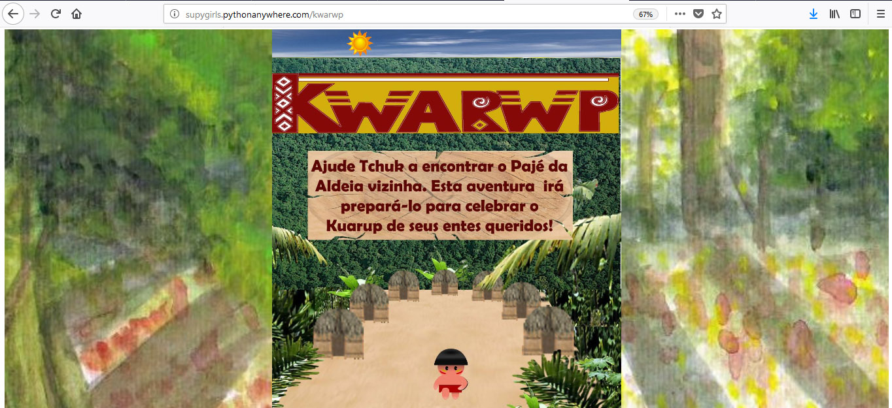
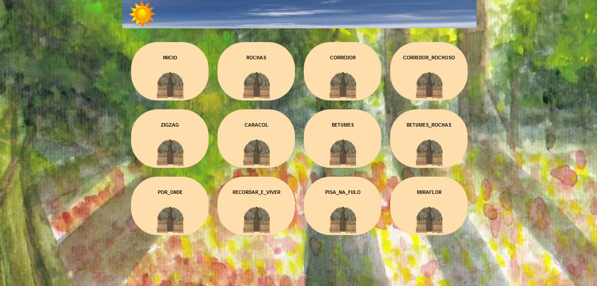
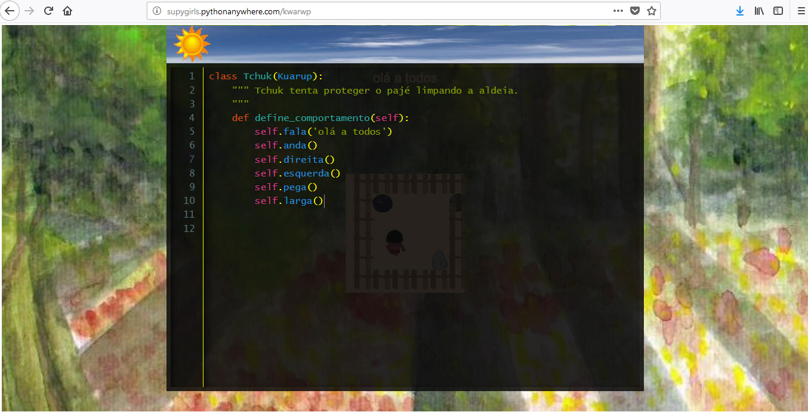
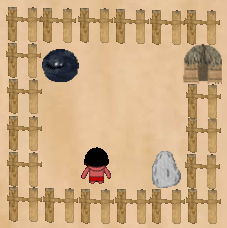
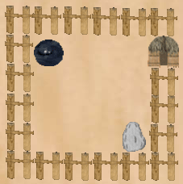

.. _Kwarwp_Apresentação:

Kwarwp - Apresentação
======================

Kwarwp é um Game que nos ensina a linguagem de programação Python enquanto ajudamos o pequeno Índio Tchuk a vencer vários desafios que o levarão ao seu objetivo.

Tchuk é um sobrevivente de sua Aldeia que foi incendiada. Segundo a tradição, ele precisa celebrar o Kuarup de seus entes queridos, que sigifica a última homenagem aos que se foram.

Para alcançar seu objetivo, Tchuk sai em busca do Pajé da Aldeia vizinha, pois ele é o único que pode prepará-lo para esta missão.

De cenário em cenário, Tchuk procura pelo Pajé através da sua ajuda: Cada frase organizada na programação em Python pode guiá-lo na direção certa!

Mas cuidado! Se Tchuk, apenas, passar por cada cenário, sem se preocupar em eliminar os perigos existentes, o Pajé pode se ferir e tudo estará perdido!

