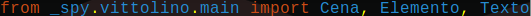
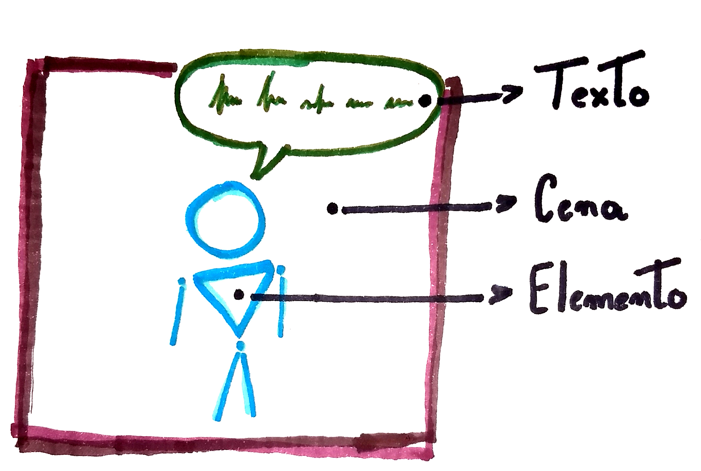
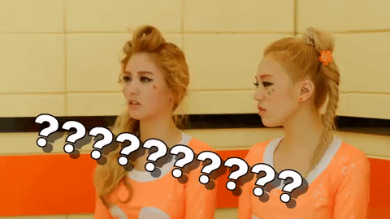
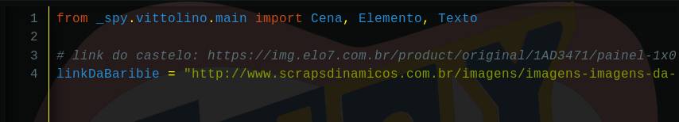
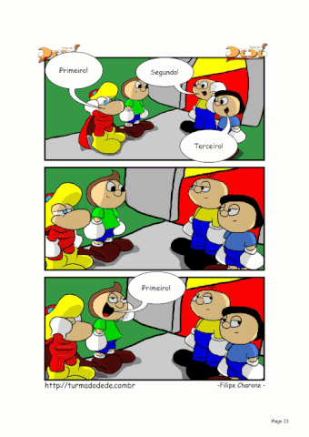

.. _arquitetura_vittolino:

A Arquitetura do Vittolino
==========================

Agora é uma boa hora pra explicar como o vittolino funciona. Vamos analisar essa frase que nós acabamos de inserir no nosso código. Não se preocupe se não entender essas coisas agora, programar é do tipo de coisa que se aprende fazendo!

from
Palavra em inglês que significa "de". ex.: Ele veio de dentro do oceano congelado da lua de Júpiter!

import
Palavra em inglês que significa "importar". ex.: Mês passado eu importei 3 cangurus Uzbequistaneses!

Ou seja, de _spy.vittolino.main importar Cena, Elemento, Texto

A história em quadrinhos que vamos construir com o Vittolino é estrturada da seguinte maneira:

Cada quadro é uma Cena, que possui Elementos que, por sua vez, possuem um Texto. Sabendo disso, o que deve ser que nossa primeira linha de código pede para o computador fazer?

Dentro do Vittolino, para construirmos algo que tem uma imagem (uma Cena ou um Elemento), precisamos que esta imagem esteja na Internet. Isso acontece porque quando formos pedir pro computador construir uma dessas coisas, a gente deverá dar para ele um link de uma imagem.

Agora é o momento de criar!

.. image:: _static/giphy6.gif

Antes de começarmos a implementar o jogo, precisamos pensar em qual história iremos contar! Busque na internet uma imagem de um cenário e uma imagem de um personagem para entrar no primeiro quadro de sua história. Se quiser já planejar toda a história e ir buscando as imagens, façam! Só não se esqueça de salvar e identificar os links que for encontrando.

Para o nosso exemplo, nós escolhemos os seguintes links:

Cena (Imagem de um Castelo)

https://img.elo7.com.br/product/original/1AD3471/painel-1x0-70-salao-de-festa-salao-de-festa.jpg

Elemento (Imagem de uma Barbie)

http://www.scrapsdinamicos.com.br/imagens/imagens-imagens-da-barbie-20.png

Para copiar o link de uma imagem, se clica com o botão direito nela e escolha a opção "Copiar Endereço da Imagem", mas atenção! Existe a possibilidade de uma imagem que você queira pegar esteja com seu endereço protegido, por isso é sempre bom testar os links que vocês selecionarem. Perceba que se você clicar em alguns dos links acima, você é redirecionado para uma página que possui apenas a imagem e nada mais.

Nós podemos ir salvando os links no próprio código ou no bloco de notas. Se você escolher salvar no pŕoprio código, você tem duas opções:

Salvar em um comentário. Utilize o '#' no começo de uma linha e escreva sua anotação depois.
Salvar numa variável. Escolha um nome sem espaços e único e escreva nome = "link". O link deve estar entre aspas.

Se você tem uma alma mais desenhista e quer criar os personagens e os cenários, também pode! Desenhe no computador ou tire fotos de algum desenho à mão e faça o upload do arquivo para um site de hosting de imagens, existem vários na Internet. Depois é só salvar os links onde suas imagens forem guardadas.

Também é o momento de se pensar nas falas de cada personagem em cada cena!

Para nosso exemplo, nós escolemos o seginte Texto para a Barbie no Castelo:

"Vim para o castelo para me abrigar de um ataque de dragões."

Não esqueça de anotar em algum lugar, no bloco de notas, no código (da mesma maneira dos links) ou no próprio papel.

Pronto! Agora que temos o primeiro quadro planejado e preparado, podemos começar a implementar em código.
