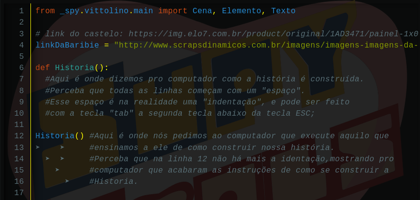
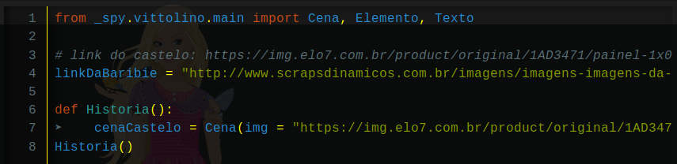
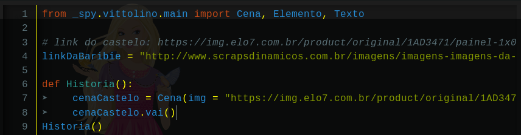
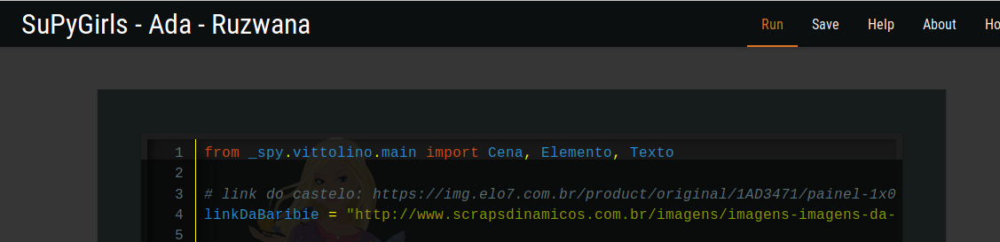
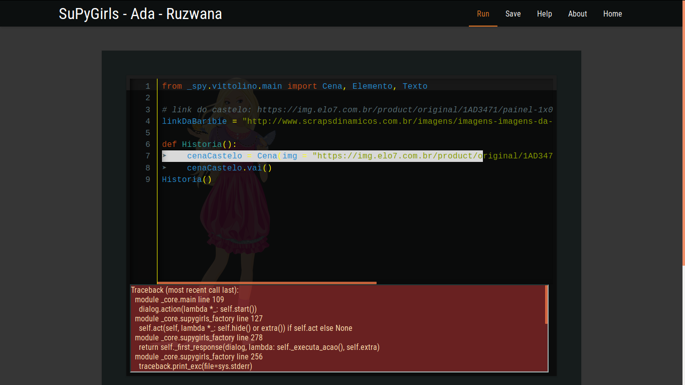

.. _implementacao_primeiro_quadro:

Implementação do Primeiro Quadro
================================

Agora precisamos pedir ao computador duas coisas para o nosso Jogo começar a andar. Primeiro, precisamos pedir pra ele anotar como construir a nossa história, e depois que contarmos pra ele, devemos pedir pra que ele realize a contrução da nossa história.

.. image:: _static/captela8.png

CALMA

.. image:: _static/giphy8.gif

Para contar para o computador como fazer algo nós usamos a palavra-chave def. Ela significa definir, ou seja, você está definindo algo novo para o computador, algo que ele não sabia. Mas para usar essa palavra, se deve usar dessa maneira:

def NomeDaquiloQueVoceVaiEnsiarSemEspacosNemAcento():

Logo após essa instrução, nós escrevemos todas as instruções daquilo que estamos ensinando ao computador de maneira indentada. A indentação é um tipo de espaço especial que diz para o computador que as instruções indentadas em sequência fazem parte daquilo que você quer ensinar a ele.

mais uma vez, agora com mais calma.

Agora precisamos dizer para o computador, como construir a Historia. Primeiro vamos precisar de uma Cena.

Nossa primeira Cena é o Castelo, mas não é porque nós salvamos o link no código que o computador sabe que essa é a nossa intenção. Nós precisamos dizer de maneira clara pra ele. Então a primeira instrução de como construir nossa história vai ser:

nomeCena = Cena(img = "link")

No caso do nosso exemplo:

Não se esqueçam de fechar as aspas e os parenteses! Agora falta muito pouco pra podermos fazer o nosso primeiro teste. Uma vez que já contamos que existe uma cena na nossa história, temos que falar pra cena "rodar", fazemos isso através da função .vai() da própria cena. Nós escrevemos:

nomeCena.vai()

No caso do nosso exemplo:

Agora vamos para o nosso primeiro teste! Procure o botão no canto direito superior escrito "Run" e reze para tudo dar certo!

RUFEM OS TAMBORES
.
.
.
.

ERROR

.. image:: _static/giphy9.gif

Tivemos um erro, nosso teste falhou. Alguma coisa em algum lugar deu errado. Algo de errado não está certo. Programar é uma constante batalha com os erros que assombram o mais astuto de todos os programadores. O computador não pensa por nós, então qualquer erro, por menor que seja, tem o potencial de fazer nosso programa parar de funcionar.

"Mas o que eu faço?!", vocês podem perguntar.

Chequem tudo. Cheque se você usou as letras maiúsculas certas, se fechou todos os parênteses, se escreveu tudo certinho, se não fecou umas aspas, ou não usou aspas, qualquer coisa pode ter acontecido. A mensagem em vermelho te dá uma dica do que pode ter acontecido no seu código. Muitas vezes ela diz precisamente onde o seu erro aconteceu, mas muitas vezes ela mais atrapalha que ajuda. Nessas horas é bom pedir ajuda pro colega ao lado ou na Internet para te ajudar a buscar o seu erro. Sabe quando a gente tá procurando lguma coisa em casa e vem alguém e smplesmente acha? Na programação também acontece. Às vezes.
