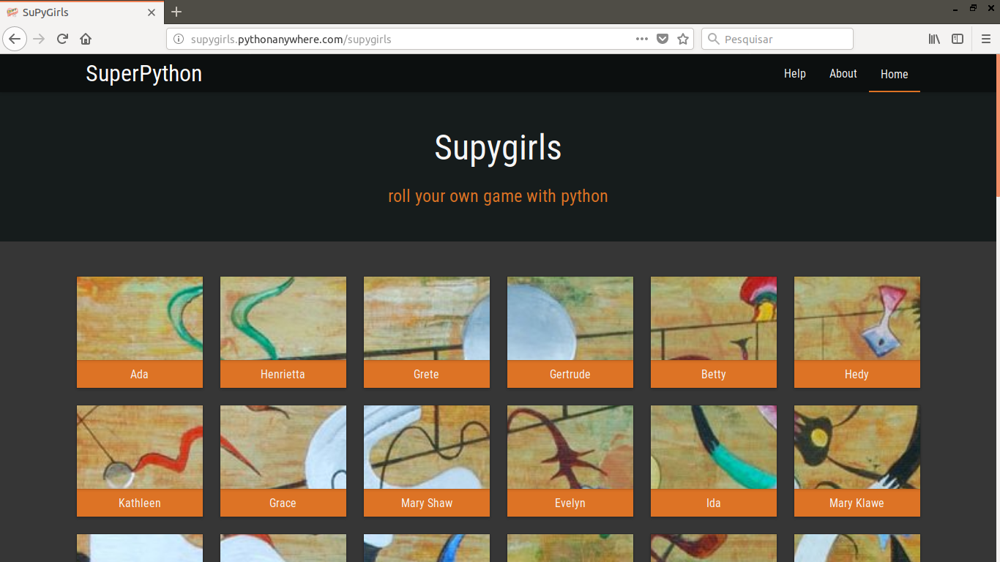
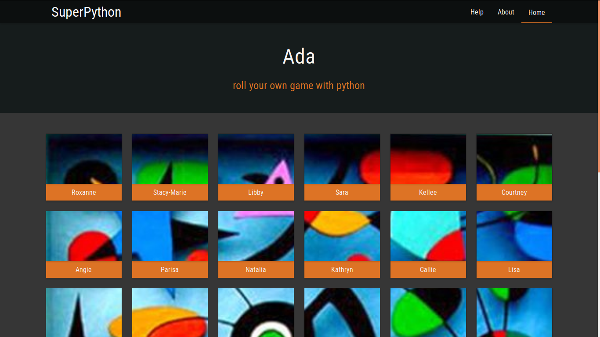

.. SuPyGirls documentation master file, created by
   sphinx-quickstart on Thursday Apr 30 20:46:18 2018.
   You can adapt this file completely to your liking, but it should at least
   contain the root `toctree` directive.

**Bem Vindos ao Tutorial SuPyGirls Connection**
===============================================

Bora programar!

Bem vindos ao SuPyGirls, hoje nós vamos começar a nos aventurar pelo incrível mundo do desenvolvimento de Jogos.

.. image:: _static/giphy1.gif

A plataforma SuperPython é um ambiente de desenvolvimento online de Jogos em python que você pode acessar de qualquer lugar através da Internet. Nela você vai encontrar algumas ferramentas pensadas para te ajudar a aprender a programar enquanto constrói jogos. Esse tutorial vai focar no uso da ferramenta Vittolino para a contrução de histórias em quadrinhos.

Primeiro devemos acessar o endereço da plataforma SupyGirls do SuperPython, que é esse aqui ó:

http://supygirls.pythonanywhere.com/supygirls

O que deve te levar direto pra cá:

Cada quadrado nomeado nesse portal é uma sala para uma turma de desenvolvimento de jogos. Você deve entrar na sala da sua turma que seu professor ou professora indicar (se ele tiver enrolando, pede pra ele dizer logo qual é, nós queremos programar!). Mas o que será que todos esses nomes tem em comum?

(pausa reflexiva)

Na sala da sua turma, existem mais quadrados nomeados. Cada quadrado nomeado é um editor de jogos, ou seja, se você clicar em qualquer um deles você vai ser levado para um ambiente onde já vai poder começar a contruir todas as doideiras que sem passam dentro da sua cabeça perturbada!

Mais nomes... suspeito...

.. image:: _static/giphy3.gif

Enfim, de volta ao que importa, JOGOS!

.. image:: _static/giphy4.gif

Sumário
=======

.. toctree::
    :maxdepth: 2

    vittolino_conte_estorias.rst
    arquitetura_vittolino.rst
    implementacao_primeiro_quadro.rst
    vitollino_nao_vittolino.rst

Indices e Tabelas
=================

* :ref:`genindex`
* :ref:`modindex`
* :ref:`search`

