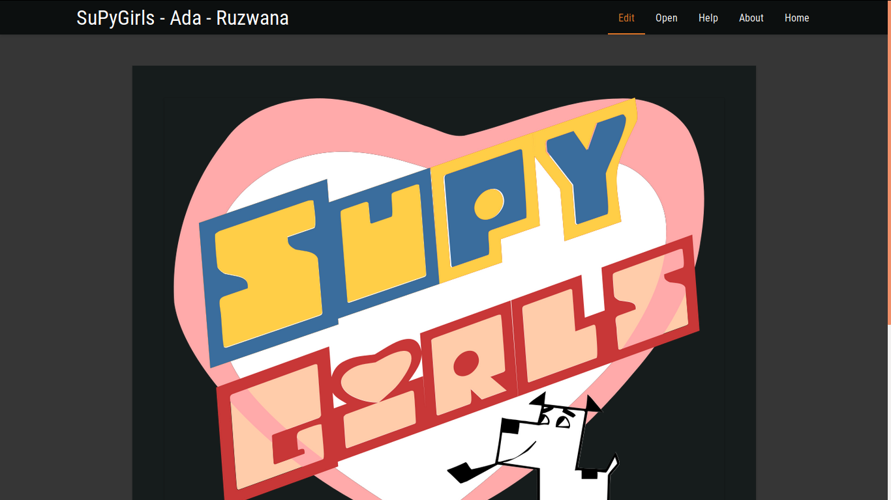
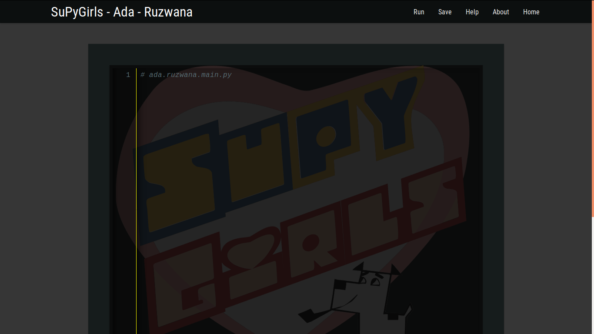
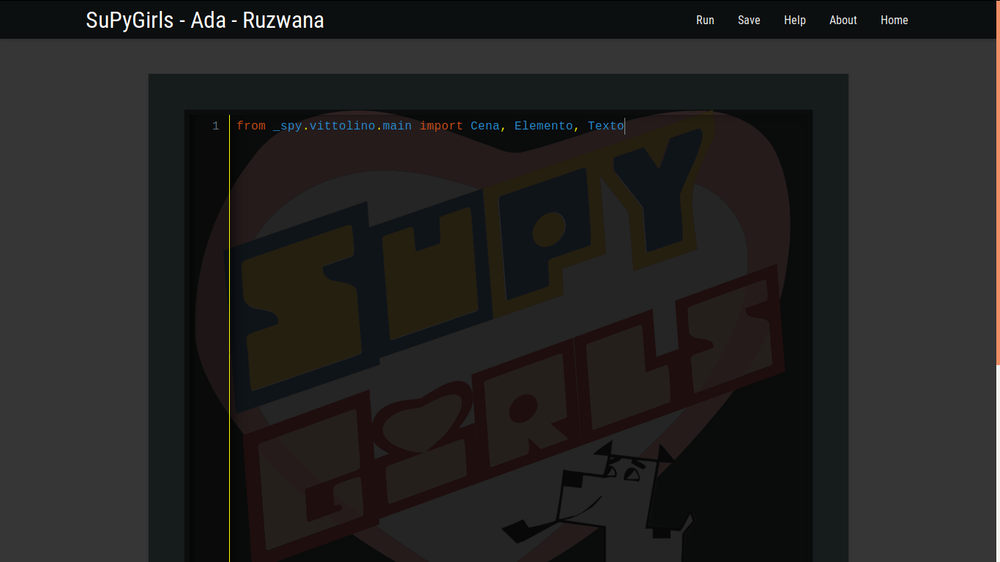

.. Flying Circus documentation master file, created by
   sphinx-quickstart on Sat Apr 30 09:13:18 2016.
   You can adapt this file completely to your liking, but it should at least
   contain the root `toctree` directive.

**Bem Vindos ao Tutorial SuPyGirls Connection**
===============================================

Bora programar!

Bem vindos ao SuPyGirls, hoje nós vamos começar a nos aventurar pelo incrível mundo do desenvolvimento de Jogos.

.. image:: _static/giphy1.gif

A plataforma SuperPython é um ambiente de desenvolvimento online de Jogos em python que você pode acessar de qualquer lugar através da Internet. Nela você vai encontrar algumas ferramentas pensadas para te ajudar a aprender a programar enquanto constrói jogos. Esse tutorial vai focar no uso da ferramenta Vittolino para a contrução de histórias em quadrinhos.

.. image:: _static/giphy2.gif

Primeiro devemos acessar o endereço da plataforma SupyGirls do SuperPython, que é esse aqui ó:

http://supygirls.pythonanywhere.com/supygirls

O que deve te levar direto pra cá:

.. image:: _static/captela1.png

Cada quadrado nomeado nesse portal é uma sala para uma turma de desenvolvimento de jogos. Você deve entrar na sala da sua turma que seu professor ou professora indicar (se ele tiver enrolando, pede pra ele dizer logo qual é, nós queremos programar!). Mas o que será que todos esses nomes tem em comum?

.. image:: _static/fun1.png
(pausa reflexiva)

Na sala da sua turma, existem mais quadrados nomeados. Cada quadrado nomeado é um editor de jogos, ou seja, se você clicar em qualquer um deles você vai ser levado para um ambiente onde já vai poder começar a contruir todas as doideiras que sem passam dentro da sua cabeça perturbada!

.. image:: _static/captela2.png

Mais nomes... suspeito...

.. image:: _static/giphy3.gif

Enfim, de volta ao que importa, JOGOS!

.. image:: _static/giphy4.gif

Vittolino - Conte Estórias
==========================

Pronto, finalmente chegamos ao editor. Essa é a tela de início. Nela você pode observar no canto superior esquerdo o nome do projeto, o nome da Sala da sua turma e o nome do editor que você escolheu. Para continuarmos, precisaremos escolher a opção Edit.

Agora chegamos ao editor do código Python. Esse código é como você vai descrever tudo o que o computador precisa fazer para ele construir o jogo que você imaginar. No momento ele só tem uma linha. Essa linha começa com o caracter '#', o que significa que ela não será lida pelo computador, ela é um cometário feito para seres humanos lerem. Eles servem para facilitar a leitura do código pelo programador.

Especificamente, essa linha é apenas uma marcação do título do documento de texto que nós vamos editar. Mas se você ficou confuso, não se preocupe, porque nós vamos apagá-la!

Agora na primeira linha nós vamos escrever o seguinte código:

from _spy.vittolino.main import Cena, Elemento, Texto

Que doido, o editor coloriu automaticamente algumas palavras para nós, o que isso deve significar:
from _spy.vittolino.main import Cena, Elemento, Texto

A Arquitetura do Vittolino
==========================

.. image:: _static/captela6.png

Agora é uma boa hora pra explicar como o vittolino funciona. Vamos analisar essa frase que nós acabamos de inserir no nosso código. Não se preocupe se não entender essas coisas agora, programar é do tipo de coisa que se aprende fazendo!

from
Palavra em inglês que significa "de". ex.: Ele veio de dentro do oceano congelado da lua de Júpiter!

import
Palavra em inglês que significa "importar". ex.: Mês passado eu importei 3 cangurus Uzbequistaneses!

Ou seja, de _spy.vittolino.main importar Cena, Elemento, Texto

A história em quadrinhos que vamos construir com o Vittolino é estrturada da seguinte maneira:

.. image:: _static/fun2.jpg

Cada quadro é uma Cena, que possui Elementos que, por sua vez, possuem um Texto. Sabendo disso, o que deve ser que nossa primeira linha de código pede para o computador fazer?

.. image:: _static/giphy5.gif

Dentro do Vittolino, para construirmos algo que tem uma imagem (uma Cena ou um Elemento), precisamos que esta imagem esteja na Internet. Isso acontece porque quando formos pedir pro computador construir uma dessas coisas, a gente deverá dar para ele um link de uma imagem.

Agora é o momento de criar!

.. image:: _static/giphy6.gif

Antes de começarmos a implementar o jogo, precisamos pensar em qual história iremos contar! Busque na internet uma imagem de um cenário e uma imagem de um personagem para entrar no primeiro quadro de sua história. Se quiser já planejar toda a história e ir buscando as imagens, façam! Só não se esqueça de salvar e identificar os links que for encontrando.

Para o nosso exemplo, nós escolhemos os seguintes links:

Cena (Imagem de um Castelo)

https://img.elo7.com.br/product/original/1AD3471/painel-1x0-70-salao-de-festa-salao-de-festa.jpg

Elemento (Imagem de uma Barbie)

http://www.scrapsdinamicos.com.br/imagens/imagens-imagens-da-barbie-20.png

Para copiar o link de uma imagem, se clica com o botão direito nela e escolha a opção "Copiar Endereço da Imagem", mas atenção! Existe a possibilidade de uma imagem que você queira pegar esteja com seu endereço protegido, por isso é sempre bom testar os links que vocês selecionarem. Perceba que se você clicar em alguns dos links acima, você é redirecionado para uma página que possui apenas a imagem e nada mais.

Nós podemos ir salvando os links no próprio código ou no bloco de notas. Se você escolher salvar no pŕoprio código, você tem duas opções:

Salvar em um comentário. Utilize o '#' no começo de uma linha e escreva sua anotação depois.
Salvar numa variável. Escolha um nome sem espaços e único e escreva nome = "link". O link deve estar entre aspas.

.. image:: _static/captela7.png

Se você tem uma alma mais desenhista e quer criar os personagens e os cenários, também pode! Desenhe no computador ou tire fotos de algum desenho à mão e faça o upload do arquivo para um site de hosting de imagens, existem vários na Internet. Depois é só salvar os links onde suas imagens forem guardadas.

Também é o momento de se pensar nas falas de cada personagem em cada cena!

.. image:: _static/giphy7.gif

Sumário
=======

.. toctree::
    :maxdepth: 2

    inicia.rst
    desafio_a.rst
    desafio_b.rst
    desafio_h.rst
    desafio_i.rst
    desafio_j.rst
    desafio_k.rst
    jogo_a.rst
    jogo_b.rst
    jogo_c.rst
    jogo_d.rst
    jogo_e.rst
    jogo_f.rst
    jogo_g.rst
    jogo_h.rst
    jogo_i.rst

Indices e Tabelas
=================

* :ref:`genindex`
* :ref:`modindex`
* :ref:`search`

