.. _vitollino_nao_vittolino:

É Vitollino, não Vittolino!
===========================

Achei o meu erro!!

Eu vinha escrevendo Vitollino errado desde o começo, inclusive aqui nesse tutorial. Eu estava escrevendo com dois t's ao invés de dois l's. Erros pequenos como esses podem custar horas, se não dias de dor de cabeça, por isso, preste mais atenção que eu ao programar! Vamos consertar o código e ver se agora funciona.

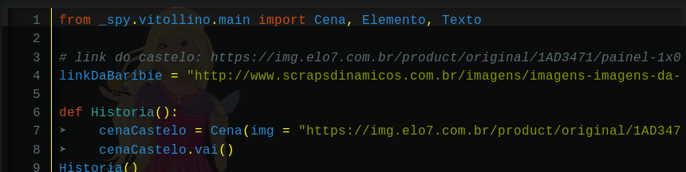

.. image:: _static/giphy10.gif

AGORA VAI!

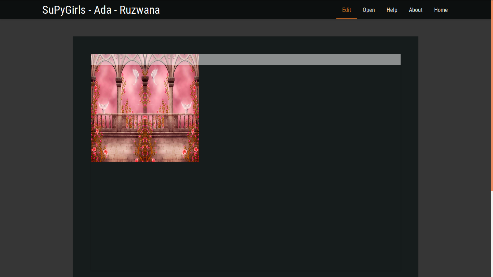

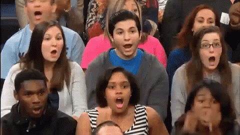

FOOOOOOOOOOOOO951OOOOOOOIIIII!!!!!1!!!!!!!111
Existe uma sensação de alívio única de achar um erro que estava travando o seu código. Nossa Cena ainda não faz nada além de simplesmente aparecer, mas pra quem não tinha nem isso, acho digno de uma comemoração.

A próxima coisa que precisamos fazer é introduzir o personagem, faremos isso de maneira semelhante do que foi feito com a cena.

nomePersonagem = Elemento(img = "link", tit = "Titulo", style = dict (top = v1, left = v2, height = v3, width = v4))

Para introduzir a Cena, nós apenas precisávamos passar a imagem da Cena. O Elemento precisa de um pouco mais que isso, precisamos dizer qual é o título daquele elemento (opcional) e um tal de style. Style é a maneira do Vitollino descrever a altura, a largura, e a posição do Elemento em Cena. Substituímos cada um daqueles valores por algum que se adeque a nossa história.

No nosso exemplo, como tinhamos o link da Barbir numa variável, podemos dar o nome da variável ao invés do link entre aspas. O nosso exemplo  fica assim:

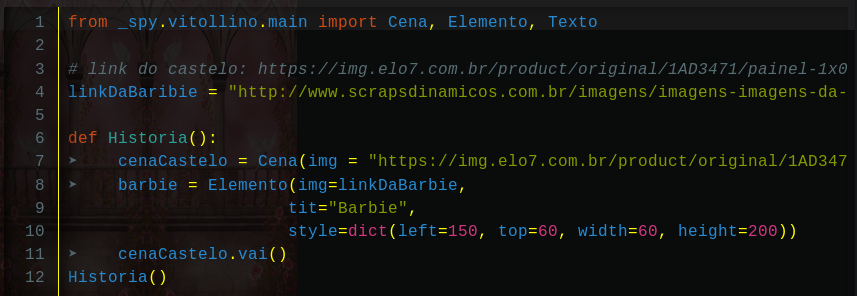

Não se preocupem! Nós podemos pular linha no meio da decaração de uma função() se isso ajudar a leitura.

Vamos testar mais uma vez para ver se está tudo em ordem.

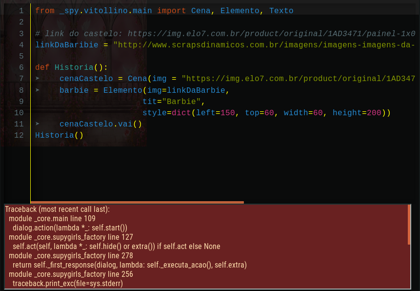

ERRO DE NOVO!

.. image:: _static/fun3.png

Erro de Novo!! O que será que deu errado dessa vez?!

Ah, já achei... Será que você consegue achar o meu erro sem ler qual é? (Duvido, rs)

Praqueles que não acaharam, eu escrevi linkDaBaribie quando eu guardei o meu link, e na hora de escrever na construção do Elemento, eu escrevi linkDaBarbie certo. Uma letra fora aqui e ali e nada funciona mais. Vamos testar mais uma vez. Também vou aproveitar para trocar o link do Castelo por uma varável, para arrumar melhor o meu código.

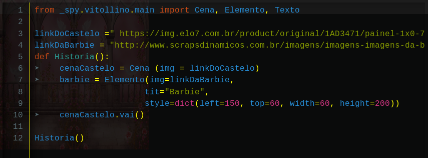

Sem erros!

Não obtivemos nenhuma mensagem de erro dessa vez, mas a Barbie ainda não apareceu. Isso é porque assim como tinhamos mandar a cena "rodar", temos que mandar o nosso personagem "entrar em cena". Nós fazemos isso através da função .entrar() do Elemento. Difetente da função .vai(), nós precisamos passar a Cena na qual o Elemento vai entrar na função .entrar().

nomePersonagem.entrar(nomeCena)

O nosso exemplo  fica assim:

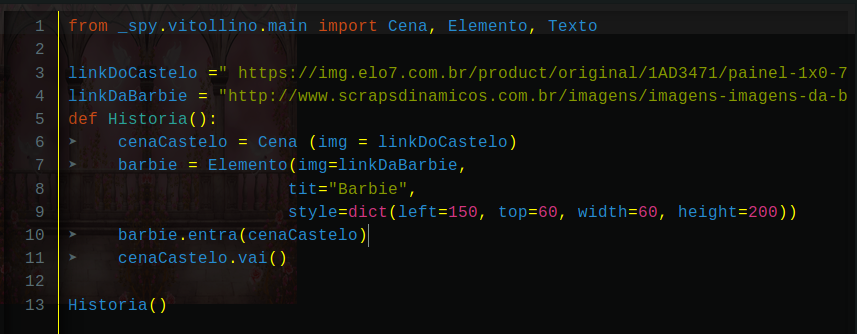

.. image:: _static/captela21.png

Sucesso!

Agora só falta inserirmos o Texto para nossa primeira página ficar completa! E assim como antes, nós iremos introduzi-lo de maneira semelhante ao Elemento e ao Personagem:

nomeTexto = Texto(nomeCena, "texto")

Assim como com Elemento e Cena, não pasta apenas contar para o computador que o Texto existe, temos que associa-lo a algum Elemento dentro da Cena que ele se encontra. Fazemos isso associando a função .vai() do Texto com a função .vai() do elemento que se deseja associar. Para se associar função, nós não escrevemos os parênteses:

nomeElemento.vai = nomeTexto.vai

No nosso exemplo, fica assim:

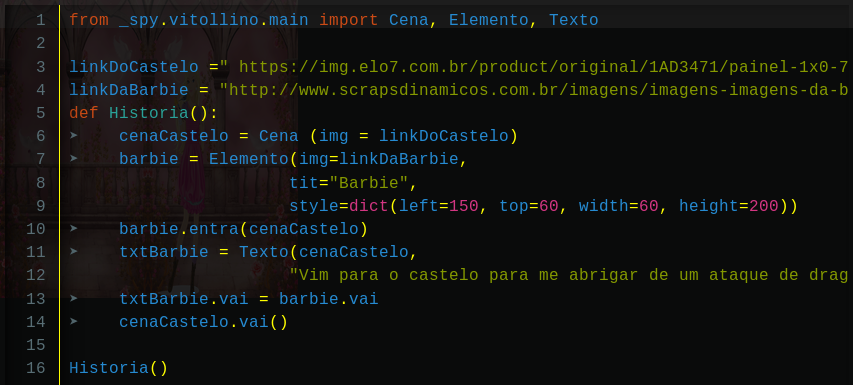

E agora o último teste da nossa primeira página!

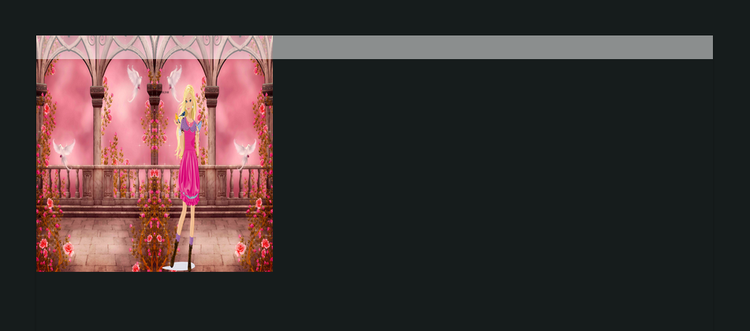

Sem texto, mais um erro!

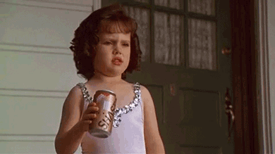

O erro que cometi agora foi a ordem da operação txtBarbie.vai = barbie.vai. Escrito dessa maneira, eu estou dizendo ao computador para fazer ação do texto da barbie ser igual a ação da barbie, que é nula. O que eu quero na verdade é juutamento o oposto, que a barbie copie a ação do texto, logo deve ser, barbie.vai = txtBarbie.vai.

E agora sim, o último teste da nossa primeira página!

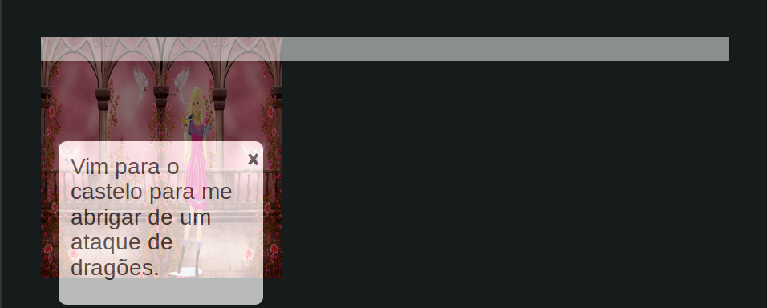

AEAEAEAEAEAEAEAEAEAEAE

.. image:: _static/giphy13.gif
