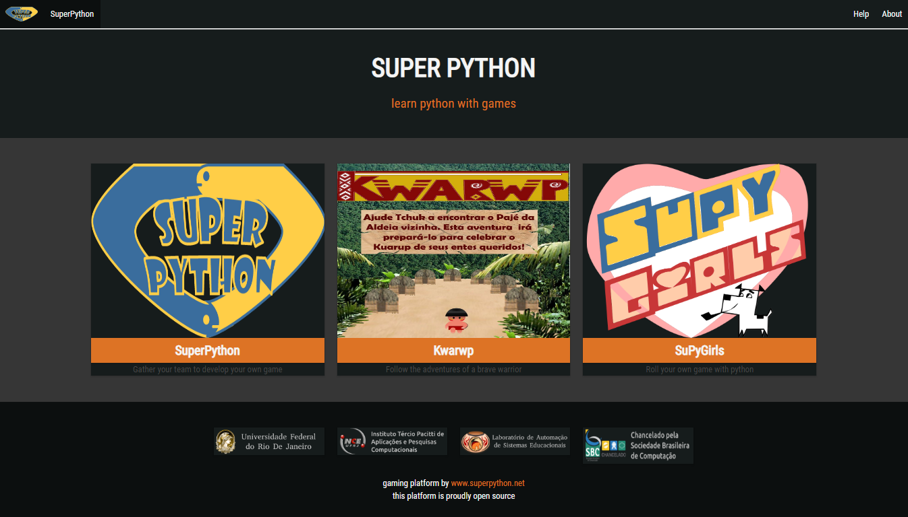
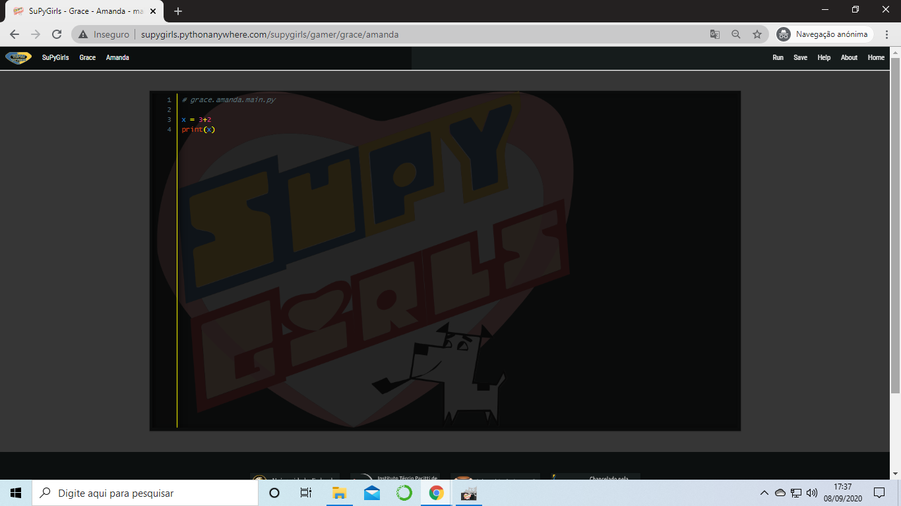

.. _Tour_Plataforma:

**Tour da Plataforma SuperPython**
====================================

Olá! Seja muito bem-vindo ao Tour da plataforma SuperPython.

Contextualizando, a plataforma Superpython é um ambiente de desenvolvimento (IDE), orgulhosamente open source, planejado para possibilitar a programação na linguagem Python.
Esta plataforma é um braço direto do  `Programa Superpython`_ que se consagra como um projeto interdisciplinar de criação e desenvolvimentos de Games por crianças, jovens e adultos.

A plataforma se mantém de pé graças ao `prof.Carlo`_ que foi o idealizador e segue atualizando a plataforma sempre!! *Ode eterno aos santos!*

.. _prof.Carlo: https://github.com/cetoli
.. _Programa Superpython: http://www.superpython.net

O presente tutorial é **unicamente** um guia de acessos da plataforma. 

Acesse: `Plataforma SuperPython`_
-----------------------------------

Página Inicial da plataforma
-----------------------------

Esta é a apresentação atual da plataforma:

.. _Plataforma SuperPython: http://supygirls.pythonanywhere.com/

 
Retornando para a página principal
-----------------------------------

Sempre que **estiver** na plataforma pode voltar à página principal clicando no botão ressaltado na lupa.

.. note::
   Em alguns momentos ele prega peças. Cuidado!

.. image:: _static/2_plataf_zoom_RETURN.png
   

Acessando os Tutoriais da Plataforma
-------------------------------------

Nossa plataforma tem alguns tutoriais e Documentos! Deixe a curiosidade fluir e divirta-se!

Detalhando a página Inicial
----------------------------

Dando um zoom out na página inicial é possível ver três botões alinhados:

* **O botão central** dá acesso ao game Kwarwp

* **Os botões extremos** dão acesso às salas de programação. :D
O clique nestes botões direcionam para o "salão principal". 

Acessando o Salão Principal de programação
-------------------------------------------
Bem-vindo ao salão principal!
Seu clique foi bem sucedido e agora você pode escolher o *pacote* correspondente ao projeto da qual você participa!
É chamado pacote pois cada um dos 'quadrados' comporta, no mínimo, 40 sub-salas prontas para você codar!

**Clique na sala com nome respectivo ao seu projeto** e 'Be Happy!'

.. Note:: 
   Esqueceu o nome da sua sala?
   Observe que abaixo dos nomes em negrito aparecem nomes de outras pessoas ou nomes característicos de um projeto. 
   Tente procurar pelo nome do seu professor ou projeto!! Se ainda tiver problemas contate o seu tutor ou `prof.Carlo`_. Com certeza te salvarão!

P.S: Você reconhece os grandes nomes que batizam as salas da Plataforma? Fica a dica! ;)

.. image:: _static/6_plataf_pacote.png

Acessando a sala pessoal de programação
----------------------------------------

O clique **em qualquer uma** das salas da imagem anterior, redireciona para uma página **idêntica a esta**. 
Agora você está vendo os módulos do pacote que você selecionou! Yuhaa!

.. Note::
   **Cuidado para não acessar as salas pessoais de outro projeto!**

E ao clicar em qualquer uma das salas você será redirecionado para sua IDE propriamente dita:

Observe a URL: supygirls.pythonanywhere.com/supygirls/game/**GRACE/AMANDA**

Esta url te indica, respectivamente, qual o pacote e módulo que você está trabalhando no momento.

Abrindo o Interpretador Python
--------------------------------
Para acessa o interpretador basta apenas clicar no botão "**edit**".

Que te trará pra cá:

Observe! Já há uma amostra de código.

Este é o espaço onde você pode desenvolver.

Startando o Interpretador 
--------------------------

Para ver sua obra-prima por completo basta clicar em run:

**RESULTADOS POSSÍVEIS:**

#. O interpretador trará respostas quando houver erro:

#. O interpretador trará respostas quando houver acerto:

.. Note::
   Caso o interpretador não responda, ou apresente respostas antigas, não se desespere:
   
                      **F5** NELEEE!!!!
        
        

.. Warning::
   NEVER. MAI. NONCH NIE. Ποτέ. 決して. 
           
   NUNCA Saia da sala sem salvar o seu trabalho!

**MÃO NA MASSAAAA, DIGO, NO TECLADOOOOOOO!!**
