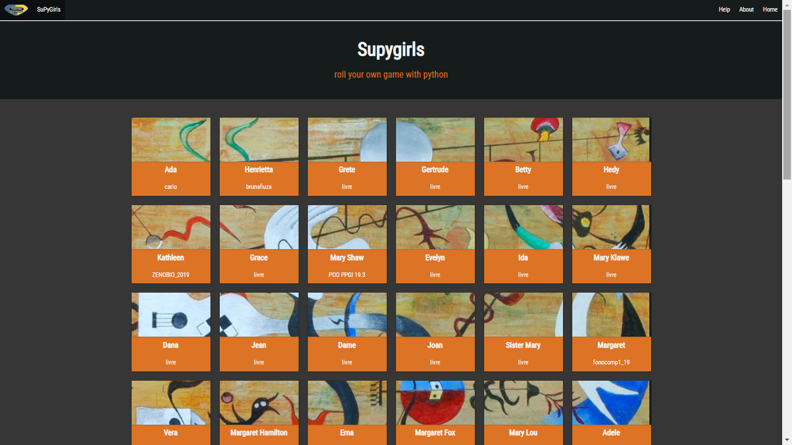

.. _Tutorial_Vitollino:

**Tutorial Vitollino**
=======================
 

.. Warning:: 
  É vitoLLino com dois *LL's*
  
  
SUMÁRIO
--------

#. `IMPORTANDO O VITOLLINO`_
#. `IMPORTANDO MÓDULOS (SALAS)`_
#. `STYLE`_
#. `CENA`_
#. `SALA`_
#. `LABIRINTO`_
#. `ELEMENTO`_
#. `POPUP`_
#. `TEXTO (PopUp)`_
#. `CÓDIGO`_
#. `BOTÃO`_
#. `MÚLTIPLA-ESCOLHA`_
#. `INVENTÁRIO`_
#. `MÚSICA`_
#. `PORTAL`_
#. `DROPPER`_
#. `DROPPABLE`_

IMPORTANDO O VITOLLINO
-----------------------

Para utilizar os recursos do vitollino é necessário, primeiramente, importá-lo para o módulo que está trabalhando.

.. code:: python

    """É análogo ao caminho _spy/vitollino/main.py """
    from _spy.vitollino.main  import Classe_Desejada, Classe_Desejada2
   
Outra forma de também importar é:

.. code:: python

    """A abreviação do nome da classe pode auxiliar na organização e clareza do código posteriormente ;)"""
    from _spy.vitollino.main import  Classe_Desejada as abreviação_qualquer
    
IMPORTANDO MÓDULOS (SALAS)
---------------------------

.. code:: python

   """ Exemplo from cenas.imix import Inicial"""
    from  nome_do_pacote.nome_do_módulo import Classe_Desejada, Classe_Desejada2
    
    
    
    """Essa linha impede cruzamentos indesejados entre os nomes dos repositórios."""
    if __name__ == "__main__":
        classe_principal()
    
    
.. seealso::
   
   Justificativa extensa da linha  `if __name__ == "__main__"`_

.. _if __name__ == "__main__": https://www.geeksforgeeks.org/what-does-the-if-__name__-__main__-do/

STYLE 
-------

.. code:: python
    
    from _spy.vitollino.main import STYLE
    
   
    
    STYLE["width"] = 900 # width = 300 (default) 
    STYLE["heigth"] = "900px" # min-height = "300px"

CENA
-----

.. code:: python

    from _spy.vitollino.main import Cena
    """Importa a classe Cena do Vitollino"""

    IMAGEM_QUALQUER = "string_correspondente_a_url_e_extensao_da_imagem" # Extensões aceitas: png, jpg, jpeg e gif
    IMAGEM_ESQUERDA = "string_correspondente_a_url_e_extensao_da_image" # Extensões aceitas: png, jpg, jpeg e gif
    IMAGEM_DIREITA = "string_correspondente_a_url_e_extensao_da_image" # Extensões aceitas: png, jpg, jpeg e gif
    IMAGEM_MEIO = "string_correspondente_a_url_e_extensao_da_image" # Extensões aceitas: png, jpg, jpeg e gif

    nome_da_cena_direita = Cena(IMAGEM_DIREITA)
    nome_da_cena_esquerda = Cena(IMAGEM_ESQUERDA)
    nome_da_cena = Cena(IMAGEM_QUALQUER, # Parâmetro obrigatório
                    esquerda=nome_da_cena_esquerda, # default = NADA = SalaCenaNula()
                    direita=nome_da_cena_direita,  # default = NADA = SalaCenaNula()
                    meio=Cena(IMAGEM_MEIO)) # default = NADA = SalaCenaNula()
    nome_da_cena_esquerda.esquerda = nome_da_cena   
           
    nome_da_cena.vai()

SALA
-----

.. code:: python

    from _spy.vitollino.main import Cena, Sala
    """A Sala é uma COLEÇÃO de cenas organizadas nos pontos cadeais norte, sul, leste e oeste
    """

    IMAGEM_NORTE= "string_correspondente_a_url_e_extensao_da_imagem" # Extensões aceitas: png, jpg, jpeg e gif
    IMAGEM_LESTE = "string_correspondente_a_url_e_extensao_da_image" # Extensões aceitas: png, jpg, jpeg e gif
    IMAGEM_OESTE = "string_correspondente_a_url_e_extensao_da_image" # Extensões aceitas: png, jpg, jpeg e gif
    IMAGEM_SUL = "string_correspondente_a_url_e_extensao_da_image" # Extensões aceitas: png, jpg, jpeg e gif

    nome_da_cena_norte = Cena(IMAGEM_NORTE)
    nome_da_cena_sul = Cena(IMAGEM_SUL)
    nome_da_cena_leste = Cena(IMAGEM_LESTE)
    nome_da_cena_oeste = Cena(IMAGEM_OESTE)

    """ Bem como na composição na Cena, a ausencia de Cena em algum dos pontos cardeais direciona para a SalaCenaNula()"""
    nome_da_sala = Sala(n=nome_da_cena_norte, s=nome_da_cena_sul, l=nome_da_cena_leste, o=nome_da_cena_oeste)

    nome_da_sala.norte.vai() # A primeira Cena a ser visualizada
    #nome_da_sala.sul.vai()
    #nome_da_sala.leste.vai()
    #nome_da_sala.oeste.vai()

LABIRINTO
----------

.. code:: python

   from _spy.vitollino.main import Cena, Sala, Labirinto
   """O Labirinto é uma coleção de Salas
   """

   IMAGEM_NORTE= "string_correspondente_a_url_e_extensao_da_imagem" # Extensões aceitas: png, jpg, jpeg e gif
   IMAGEM_LESTE = "string_correspondente_a_url_e_extensao_da_image" # Extensões aceitas: png, jpg, jpeg e gif
   IMAGEM_OESTE = "string_correspondente_a_url_e_extensao_da_image" # Extensões aceitas: png, jpg, jpeg e gif
   IMAGEM_SUL = "string_correspondente_a_url_e_extensao_da_image" # Extensões aceitas: png, jpg, jpeg e gif

   IMAGEM2_NORTE= "string_correspondente_a_url_e_extensao_da_imagem" # Extensões aceitas: png, jpg, jpeg e gif
   IMAGEM2_LESTE = "string_correspondente_a_url_e_extensao_da_image" # Extensões aceitas: png, jpg, jpeg e gif
   IMAGEM2_OESTE = "string_correspondente_a_url_e_extensao_da_image" # Extensões aceitas: png, jpg, jpeg e gif
   IMAGEM2_SUL = "string_correspondente_a_url_e_extensao_da_image" # Extensões aceitas: png, jpg, jpeg e gif

   """Cria as cenas da primeira sala"""
   nome_da_cena1_norte = Cena(IMAGEM_NORTE)
   nome_da_cena1_sul = Cena(IMAGEM_SUL)
   nome_da_cena1_leste = Cena(IMAGEM_LESTE)
   nome_da_cena1_oeste = Cena(IMAGEM_OESTE)

   """Cria a sala com a primeira leva de cenas"""
   nome_da_sala1 = Sala(n=nome_da_cena_norte, s=nome_da_cena_sul, l=nome_da_cena_leste, o=nome_da_cena_oeste)

   """Cria as cenas da segunda sala"""
   nome_da_cena2_norte = Cena(IMAGEM2_NORTE)
   nome_da_cena2_sul = Cena(IMAGEM2_SUL)
   nome_da_cena2_leste = Cena(IMAGEM2_LESTE)
   nome_da_cena2_oeste = Cena(IMAGEM2_OESTE)

   """Cria a sala com as segunda leva de cenas"""
   nome_da_sala2 = Sala(n=nome_da_cena2_norte, s=nome_da_cena2_sul, l=nome_da_cena2_leste, o=nome_da_cena2_oeste)
   
   """Gera o Labirinto"""
   resulta_labirito=Labirinto(c=nome_da_sala1,n=nome_da_sala2)
   """Inicia o labirinto referenciando a Sala e a cena"""
   resulta_labirinto.centro.norte.vai()

ELEMENTO
---------

.. code:: python

   from _spy.vitollino.main import Cena, Elemento
   """ O elemento é um objeto passível de ser colocado em alguma cena.
   """
   MINHA_CENA = "string_correspondente_a_url_e_extensao_da_imagem" # Extensões aceitas: png, jpg, jpeg e gif
   MEU_ELEMENTO = "string_correspondente_a_url_e_extensao_da_imagem" # Extensões aceitas: png, jpg, jpeg e gif
   
   nome_da_cena = Cena(MINHA_CENA)
   nome_do_elemento = Elemento(MEU_ELEMENTO, tit="título_do_elemento", 
                              style=dict(height=60,widht=60, left=600, top=20), # ou x=eixo_x, y=eixo_y, w=largura, h=altura
                              cena = nome_da_cena,
                              vai = ação_executável_no_clique)

POPUP
-----

TEXTO (PopUp)
--------------

CÓDIGO
-------

BOTÃO
------

MÚLTIPLA-ESCOLHA
-----------------

INVENTÁRIO
-----------

.. code:: python

   from _spy.vitollino.main import Cena, Elemento
   from _spy.vitollino.main import INVENTARIO as inv
   """O inventário funciona como um depósito de elementos não resgatáveis
   """
   
   MINHA_CENA = "string_correspondente_a_url_e_extensao_da_imagem" # Extensões aceitas: png, jpg, jpeg e gif
   MEU_ELEMENTO = "string_correspondente_a_url_e_extensao_da_imagem" # Extensões aceitas: png, jpg, jpeg e gif
   
   
   inv.inicia()
   nome_da_cena = Cena(MINHA_CENA)
   nome_do_elemento = Elemento(MEU_ELEMENTO, tit="título_do_elemento", 
                              style=dict(height=60,widht=60, left=600, top=20), # ou ,x=eixo_x, y=eixo_y, w=largura, h=altura,
                              cena = nome_da_cena,
                              vai = self.coloca_no_inventario)
                              
   coloca_no_inventario = lambda *_: inv.bota(nome_do_elemento, True) #testar     
   
   def coloca_no_inventário(self, *_):
      """Gera um função que será resgatada no vai() do elemento para associar o clique à entrada no inventário"""
      inv.bota(nome_do_elemento, True)  
      
      
É possível resgatar o Elemento construindo uma classe que tenha o método de resgate

     
.. code:: python

 from _spy.vitollino.main import Cena, Elemento
 from _spy.vitollino.main import INVENTARIO as inv
 
 MEU_ELEMENTO = "string_correspondente_a_url_e_extensao_da_imagem" # Extensões aceitas: png, jpg, jpeg e gif
 MINHA_CENA = "string_correspondente_a_url_e_extensao_da_imagem" # Extensões aceitas: png, jpg, jpeg e gif
 
 class Item_herdado(Elemento):
     """Construção de uma classe que herde de Elemento
     """
     def bota(self, *_): 
          """Aciona estado de inv.bota = True para que eventual clique devolva o Elemento para a cena"""
          inv.bota(self, True)
          #self.vai=lambda*_:self.resgata(x=x,y=y,w=w,h=h)
          """Método vai do Elemento atrelado ao evento de reposicionamento, onde o memento especifica os argumentos pedidos pelo método resgata."""
          self.vai=lambda*_:self.resgata(*self.memento)

      def resgata(self,x,y,w,h):
          """Método para resgate do Elemento no inventário"""
          self.x,self.y,self.w,self.h= x,y,w,h
          """Retira Elemento atrelado ao título do inventário"""
          inv.tira(self.tit)
          """Coloca Elemento na cena"""
          self.entra(inv.cena)
          """Aciona estado de inv.bota = False para que eventual clique devolva o Elemento para o inventário"""
          self.vai=self.bota

      def mementor(self,memento):
          """Permite que o style do elemento a ser recolocado na tela seja especificado"""
          self.memento=memento

  class Minha_cena():

      def __init__(self):
          inv.inicia()
          self.minha_cena=Cena(MINHA_CENA)

          self.meu_elemento=Item_herdado(MEU_ELEMENTO, tit="nome_do_meu_elemento",style=dict(height=60,widht=60, left=100, top=100),cena=self.minha_cena)
          self.meu_elemento.mementor((110,150,200,"200px"))
          self.meu_elemento.vai=self.meu_elemento.bota

          self.minha_cena.vai()

  if __name__ == "__main__":
      Minha_cena()     

MÚSICA
-------

PORTAL
--------

DROPPER
--------

DROPPABLE
----------
