**Programação no Ubuntu**
=============================

O Ubuntu é uma - de muitos - distribuição do sistema operacional (SO) Linux produzida pela empresa Canonical.

É uma distribuição gratuita e muito popular entre programadores pois possui uma estrutura de gestão, embora pouco intuitiva ao primeiro olhar, que entrega ao usuário a administração do sistema em troca de poucos comandos no console.

Vamos colocar na ponta do lápis:

+----------------------------------------------------+
|VANTAGENS E DESVANTAGENS                            |
+=========================+===========+==============+
|                         |LINUX      |WINDOWS       |
+-------------------------+-----------+--------------+
|SIST. OPERACIONAL        |GRATUITO   |PAGO          | 
+-------------------------+-----------+--------------+
|ATUALIZAÇÃO DO SISTEMA   |SIM        |SIM           |
+-------------------------+-----------+--------------+
|SISTEMAS DIVERSIFICADOS  |SIM*       |NÃO           |
+-------------------------+-----------+--------------+
|SEGURANÇA                |SEGURO     |ANTI-VÍRUS    |
+-------------------------+-----------+--------------+
|DRIVERS GERAIS           |SIM        |SIM           |
+-------------------------+-----------+--------------+
|DRIVERS "ESPECIAIS"      |EXTERNOS*  |SIM           |
+-------------------------+-----------+--------------+
|JOGOS                    |PRÓPRIOS   |SIM           |
+-------------------------+-----------+--------------+
|ADMINISTRAÇÃO            |TOTAL      |PARCIAL       |
+-------------------------+-----------+--------------+
|ATUALIZAÇÕES AUTOMÁTICAS |SIM        |SIM           |
+-------------------------+-----------+--------------+

*O linux tem sistemas diversos que podem ser escolhidos visando as possibilidades do computador. Por exemplo, a distribuição Lubuntu visa computadores com mínimo 2gb de memória e processadores antigos.

*Quanto ao drivers especiais, há algumas dificuldades no uso de algumas placas de vídeo, monitores não vga e afins. É possível fazê-los funcionar na maioria das vezes, porém requer um esforço de pesquisa por drivers na internet.

Sem mais delongas...

SUMÁRIO
-------

#. INSTALAÇÃO DA MÁQUINA VIRTUAL

INSTALAÇÃO DA MÁQUINA VIRTUAL
-------------------------------

A máquina virtual é um sistema que permite o gerenciamento de um novo sistema operacional ou software. O interessante no uso de uma máquina virtual é a possibilidade de estender seu computador sem danificar seu sistema principal. 

Em outras palavras, no uso do novo sistema operacional, você roda o Linux dentro do Windows, o windows dentro do mac, o windows dentro do Linux...

Vamos ao passoa  passo:

1. Baixe o software Oracle VM VirtualBoX 
   Link para download: `Download VM VirtualBoX`_
   
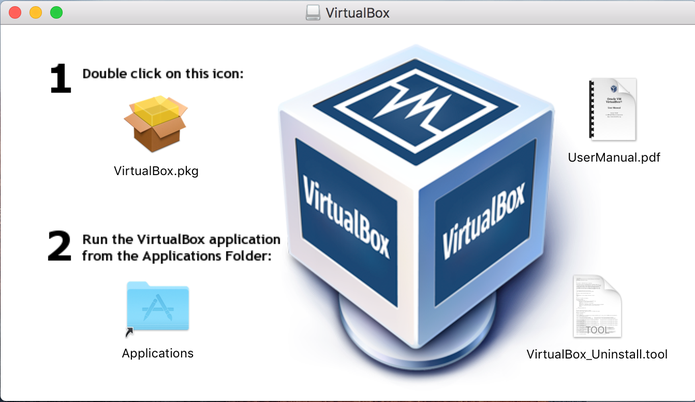

2. Clique no ícone do Virtualox na sua pasta de downloads.

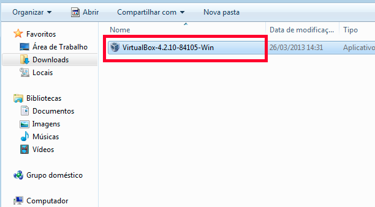

3. Abrirá uma aba que indica o início do seu processo de instalação.
Clique em NEXT.

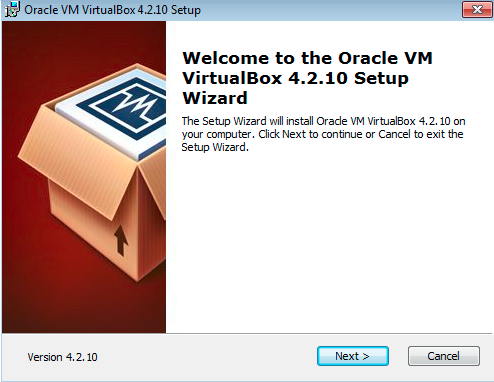

4. A próxima aba indica o local em que o programa será salvo em seu computador. Mantenha as informações selecionadas ou mude a seu gosto e clique em NEXT.

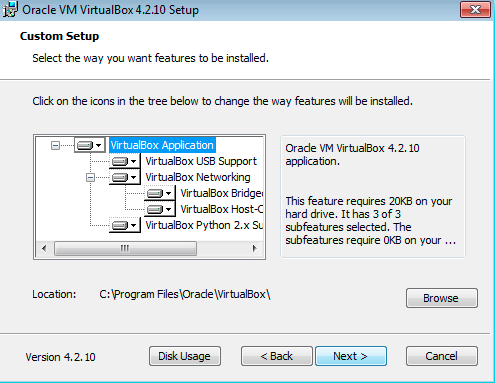

5. Faça suas escolhas e clique em NEXT.

 A aba abaixo indica se você quer um atalho para o seu Desktop ( primeiro quadrado selecionado) e para sua barra de ferramentas ( segundo quadrado selecionado). 
 
 .. image:: _static/vbox5.png
 
 6. Essa é uma aba de atenção. Indica que para prosseguir com a instalção você será disconectado da internet. Salve o que for preciso e clique em NEXT.

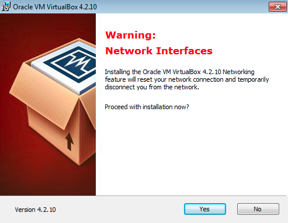

7. Finalmente, estamos prontos para iniciar o real processo de instalção. Clique em NEXT.

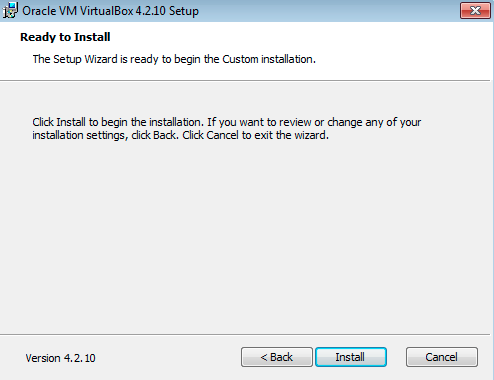

8. Sua instalção está completa. Clique em FINISH.

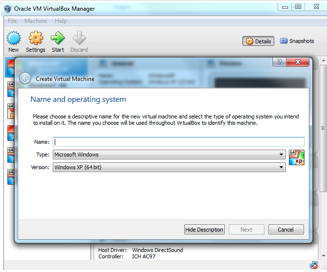

INSTALAÇÃO DO UBUNTU NA MÁQUINA VIRTUAL
----------------------------------------

1. Selecione abaixo um Linux compatível com o seu computador:

+-----------------------------------------------------------+
|DISTRIBUÇÕES LINUX                                         |
+=========================+=================+===============+
|                         |REQUISITO        |64BIT  |32BIT  |
+-------------------------+-----------------+---------------+
|LUBUNTU                  | 700MBRAM;10GB HD|`L64`_ |`L32_` |
+-------------------------+-----------+-----+-------+-------+
|UBUNTU 20.04             | 4GBRAM;25GB HD  |`U64`_ |       |
+-------------------------+-----------------+---------------+
|Elementary OS            |                 |`E64`_ |       |
+-------------------------+-----------------+-------+-------+

.. Note::
   Existem diversas distribuições além das disponibilizadas acima. É só dar um google.
   
2. Abrir o Oracle VM VirtualBox Gerenciador e **clicar em Creat Virtual Machine**.

Preencha e clique em NEXT:

   * Name: *Seu nome*
   * Type: Linux
   * Version: *Nome da sua versão*
   
3. Selecione tamanho da memória: 2048 e clique em NEXT

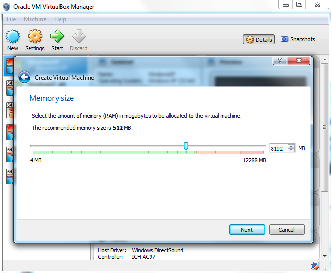

4. Clique em create

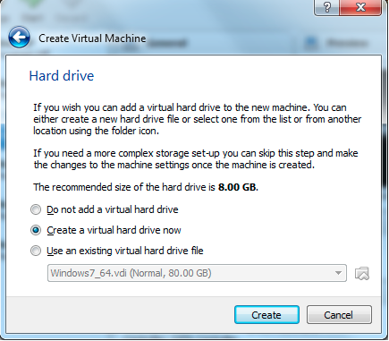

5. Selecione VDI (VIRTUALBOX Disk Image)

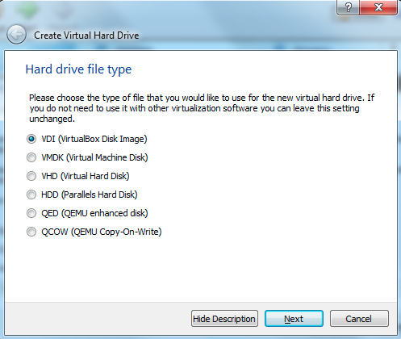

6. **SELECIONE DINAMICALLY ALLOCATED**

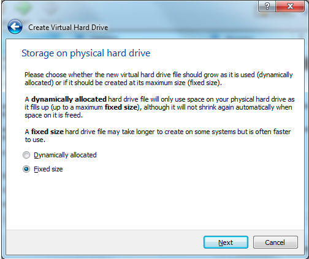

7. Localização e tamanho do arquivo.

.. Warning::
   O tamanho do arquivo dependerá do espaço disponível no HD do seu computador.
   

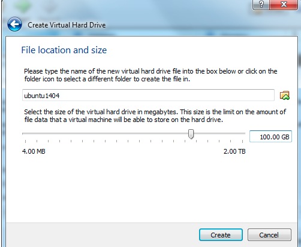

8. no campo à direita, o Armazenamento estará, por padrão *empty*, clique e selecione **Ide secundário Master**.

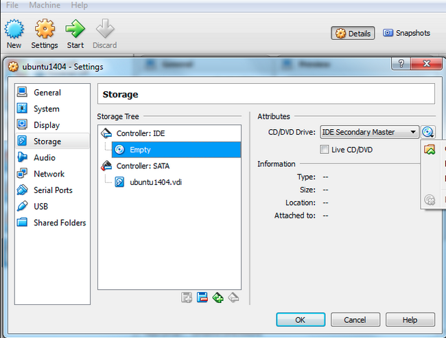

9. Clique no cd azul próximo à seta. 

10. Selecione o arquivo do que você baixou para o seu computador.

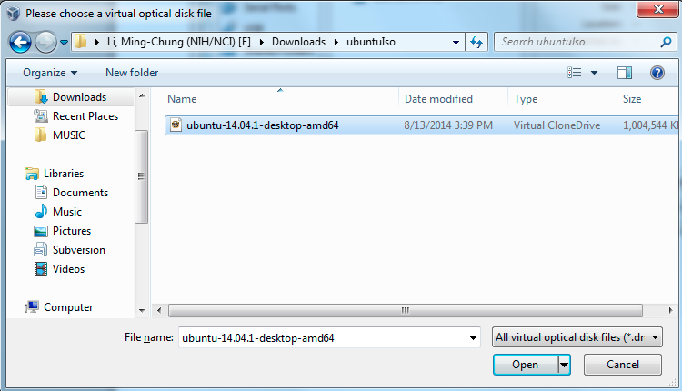

11. Observe se na imagem de CD aparece o do seu arquivo. Se sim, clique seta verde.

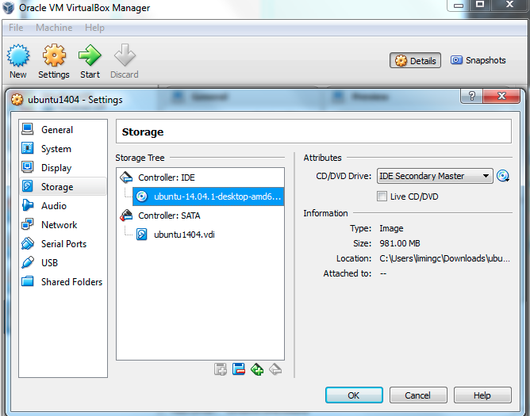

12. Clique em ok. 

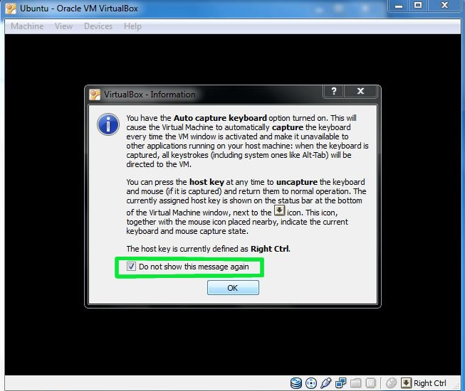

13. Espere alguns segundos até abrir a janela de instalção do Ububtu. 
   
    * Selecione o idioma de preferência à esquerda;
    * Clique em instalar ubuntu;
   
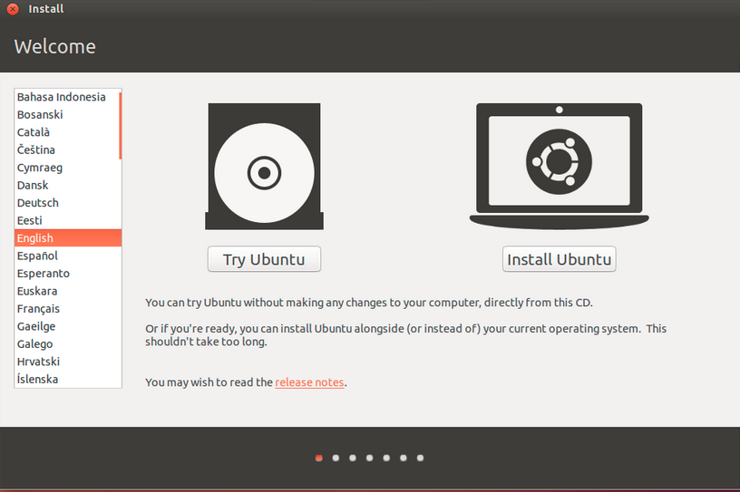

14. Selecione Install Updates e clique em CONTINUE

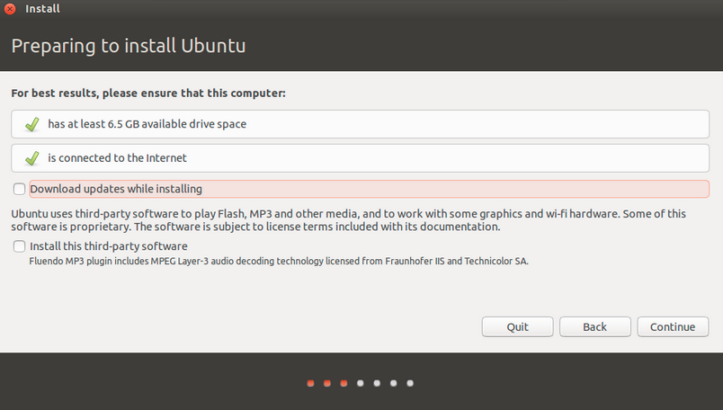

15. Selecione a primeira opção que é apagar o disco e instalar o Ubuntu. Clique em CONTINUE.

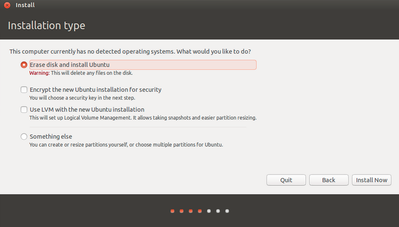

16. Escolha sua Cidade.

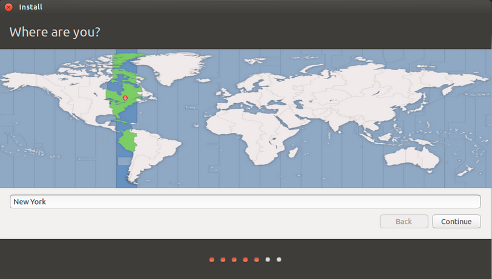

17. Escolha sua língua falada e teclado.

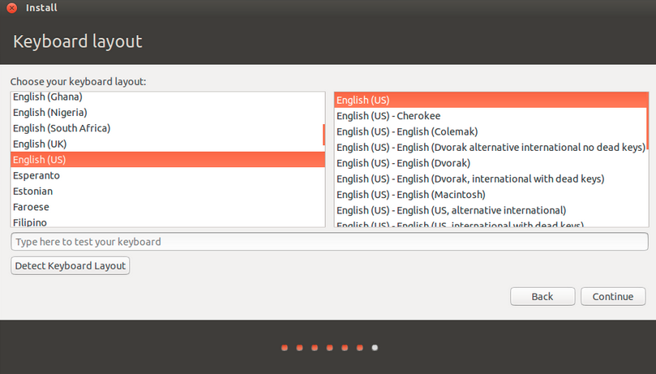

18. Na aba "Who are you" crie respectivamente: seu nome , o nome do seu computador, seu login, sua senha, confirme sua senah e selecione requerer senha.

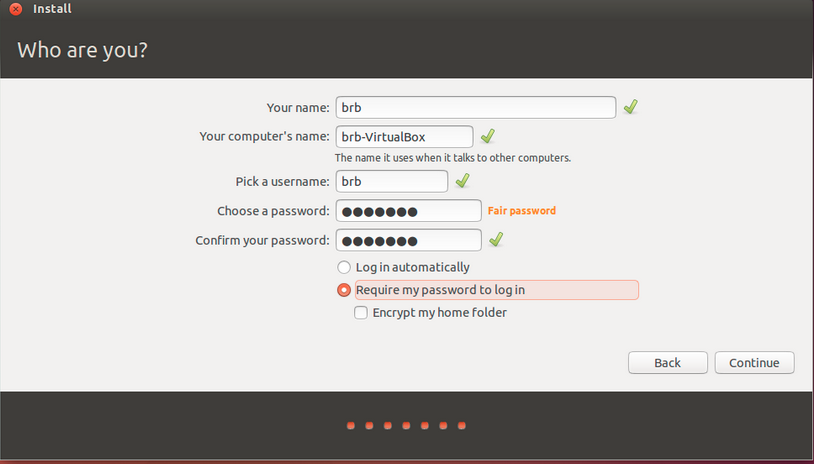

19. Espere seu sistema instalar (pode ser que demore um longo tempo).

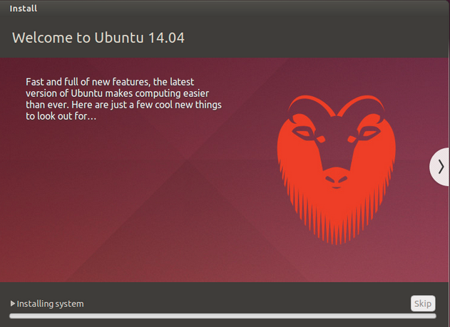

20. Dê OK na aba e seu Ubuntu estará instalado no seu VirtualBox.

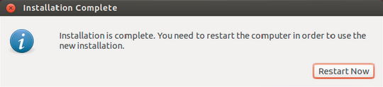

.. _Download VM VirtualBoX: https://download.virtualbox.org/virtualbox/6.1.14/VirtualBox-6.1.14-140239-Win.exe
.. _U64: https://releases.ubuntu.com/20.04.1/ubuntu-20.04.1-desktop-amd64.iso
.. _L32: http://cdimage.ubuntu.com/lubuntu/releases/18.04/release/lubuntu-18.04-alternate-i386.iso
.. L64: http://cdimage.ubuntu.com/lubuntu/releases/18.04/release/lubuntu-18.04-alternate-amd64.iso
.. E64: https://nyc3.dl.elementary.io/download/MTYwMjY4OTY2Nw==/elementaryos-5.1-stable.20200814.iso

