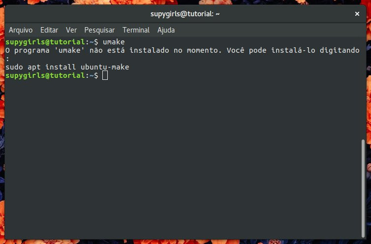
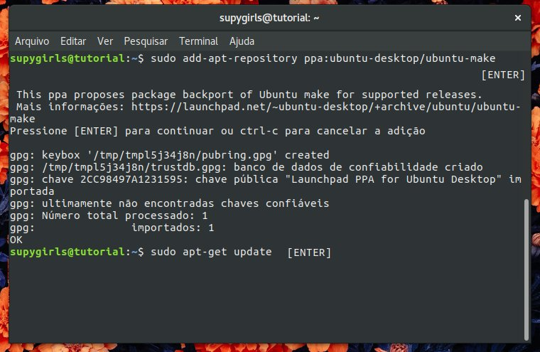
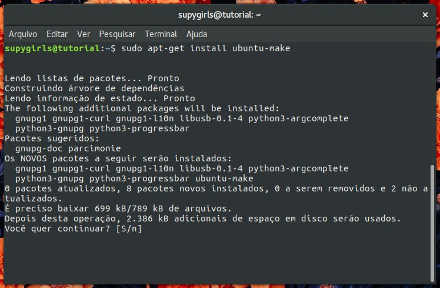

**INSTALAÇÃO DE PROGRAMAS**
============================

.. seealso::
   Este documento é uma adaptação do tutorial já existente: :doc:`../intro_comp/instalacao_programas`
   
SUMÁRIO
--------

#. `AMBIENTANDO O TERMINAL`_
#. `INSTALANDO O PYTHON`_
#. `COMANDO U-MAKE`_
#. `INSTALANDO PYCHARM`_
#. `PIP: O INSTALADOR DE PACOTES`_ 

AMBIENTANDO O TERMINAL
-----------------------

O terminal é o grande centro de comunicação entre o usuário e o computador. Através de simples comandos você pode, essencialmente, criar, excluír, copiar, mover, esconder, mesclar, baixar arquivos.
Há muitas outras funções porém ditá-las aqui seria impossível!

Vamos ao que interessa:

1. Você tem acesso ao terminal teclando: ``ctrl+Shift+T`` (simultâneamente)

.. image:: 

Este é o terminal. Inicialmente você está com as permissões superficiais de gerenciamento.

2. Para acessar as permissões totais de gerenciamento (ser um root) tecle:

.. code-tab:: bash
    
    sudo su 

.. image:: 

3. Digite a senha que utilizou para acessar seu computador 

.. image:: 

4. **PRONTO!** Vo

.. Warning:: 
   Quando o modo root está ativado toda e qualquer alteração é aceita.
   
5. Para sair do modo root digite: 
 
.. code-tab:: bash
    
    exit    

.. Note:: Saia sempre do modo root quando não estiver precisando dele.

6. Neste site você pode encontrar alguns outros comandos para o console: `LISTA DE COMANDOS`_

INSTALANDO O PYTHON
--------------------

Geralmente o python já vem instalado no Linux. Mas vale a pena consultar!

1. Abra o terminal

2. Digite: 

.. code-tab:: bash
    
    python --version

Se nenhum python for encontrado em seu computador siga para etapa 3.

3. Digite: sudo apt-get install python3-pip
 
.. code-tab:: bash
    
    sudo apt-get install python3-pip

Com este comando você instala o gerenciador de pacotes conjuntamente.

4. **Pronto! Python Instalado**

COMANDO U-MAKE
-----------------

O Ubuntu make (u-make) é uma ferramenta que facilita a intalação de ferramentas populares de programação e ainda instala todas as dependências necessárias!

1. Abra o terminal digitando ctrl+Shift+t
2. Digite **umake** para saber se o programa já está instalado no seu computador

.. code-tab:: bash
   
   umake

3. Atualize a biblioteca de repositórios com os seguintes comandos:

.. code-tab:: bash
   
   Sudo su

Insira a senha.  

.. code-tab:: bash

   add-apt-repository ppa:ubuntu-desktop/ubuntu-make
   
.. code-tab:: bash

   apt-get update
      

4. Digite: sudo apt-get install ubuntu-maker

  
6. Agora o umake está instalado!
   
7. Digite: 

.. code-tab:: bash
 
   umake --help

Este comando dispõe informações sobre quais softwares podem ser instalados através do ubuntu.

INSTALANDO PYCHARM
--------------------      

.. code-tab:: bash
  
   umake ide pycharm
   
2. Pressione enter
3. Digite a senha

 .. image:: _static/umaker4.jpg

PIP: O INSTALADOR DE PACOTES
------------------------------

.. _LISTA DE COMANDOS:: https://www.devmedia.com.br/comandos-importantes-linux/23893

