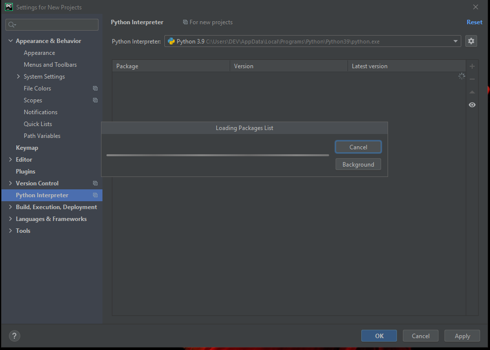

**INSTALAÇÃO DE SOFTWARES RECOMENDADOS**
=========================================

.. seealso::
   
   Este tutorial é uma adaptação do tutorial existente em: :doc:`../intro_comp/instalacao_programas`
   
SUMÁRIO
--------

#. `INSTALAÇÃO DO PYCHARM`_
#. `CONFIGURAÇÃO DO PYCHARM`_
#. `IMPORTANDO PROJETOS`_
#. `CLONANDO PROJETOS ATRAVÉS DO LINK`_
#. `CLONANDO PROJETOS ATRAVÉS DA CONTA`_

 

INSTALAÇÃO DO PYCHARM
----------------------

1. Acesse o link `Download do Pycharm`_ 

2. Escolha o download do ``Python Community``.

3. Salve o arquivo no seu computador.

4. Abra o arquivo que você baixou e clique em ``Next``.

5. Selecione ``Next``

6 Selecione todas as caixinhas e clique em ``Next``

7. Selecione ``Install``

8. Aguarde...

9. Escolha ``reiniciar agora`` **ou** ``reiniciar depois`` e depois clique em ``finish``

.. Warning::

   Antes de selecionar ``Reboot now`` tenha certeza de que salvou todos os seus trabalhos!

**Pronto!!!!! O Pycharm está instalado!**

CONFIGURAÇÃO DO PYCHARM
------------------------

10. Clique no ícone do Pycharm na sua área de trabalho.

.. image:: _static/confPC_1.png

11. Selecione ``Do not import settings`` e clique em ``ok``

12. Selecione o tema que preferir:

13. Selecione ``Skip Remaining and Set Defaults`` e **aguarde**:

14. Após um tempo, o programa abrirá esta tela. Clique no ``configure``:

15. Clique em ``Settings``.

16. À esquerda, clique no ``>`` do ``Version Control`` e **depois** clique em ``Python Interpreter``.

Você verá esta tela:

17. Clique no espaço que diz ``<No interpreter>`` e selecione a opção ``Python 3.9``

**Antes**

**Depois**

.. Note::
   
   Esta etapa só foi possível pois instalamos previamente o python na máquina! :D

18. Agora clique em ``Apply`` e depois em ``ok``:

IMPORTANDO PROJETOS
---------------------

14. Você deve estar vendo esta tela agora:

15. Clique em ``Get from Version Control`` e *depois** em ``GitHub``

.. image:: _static/confPC_9.jpg

15. Nesta tela clique em ``Download and Install``. 

depois:

15. Nesta tela há duas possibilidades: *clonar projetos através do link* e *clonar projetos da conta github*

* **CLONANDO PROJETOS ATRAVÉS DO LINK**:

1. Espere a conclusão do download do git.

 
2. No espaço ``URL`` insira o link do repositório que você deseja clonar:

3. No espaço ``Directory`` dê um nome ao seu novo projeto (clone) alterando **a última parte do caminho**.

Exemplo:

.. code:: python
   
   C:\Users\DEV\PycharmProjects\NEW_PROJECT # este é o caminho atual
   
Eu posso alterar para:

.. code:: python
   
   C:\Users\DEV\PycharmProjects\Meu_Novo_Clone # este é o caminho com outro nome

.. Warnings::

   Não são aceitos **espaços**, logo, tudo deve estar unido por ``_``, ``-``
   
   Pontos ``.`` não são recomendados. 

4. Clique em ``Clone`` e verá esta tela:

5. Posteriormente verá esta:

6. E então **TCHARAAAAAM!!!!!**   Pycharm pronto para o uso!

* **CLONANDO PROJETOS ATRAVÉS DA CONTA**:

1. Clique no ``GitHub`` à esquerda.

2. Clique em ``Log In via GitHub``

3. Autorize o vículo entre o Pycharm e o GitHub

4. Adicione seu login e senha

5. Volte para o Pycharm e selecione o Repositório que deseja:

6. Aguarde o carregamento...

7. Posteriormente verá esta:

8. E então **TCHARAAAAAM!!!!!**   Pycharm pronto para o uso!

.. _Download do Pycharm: https://www.jetbrains.com/pycharm/
