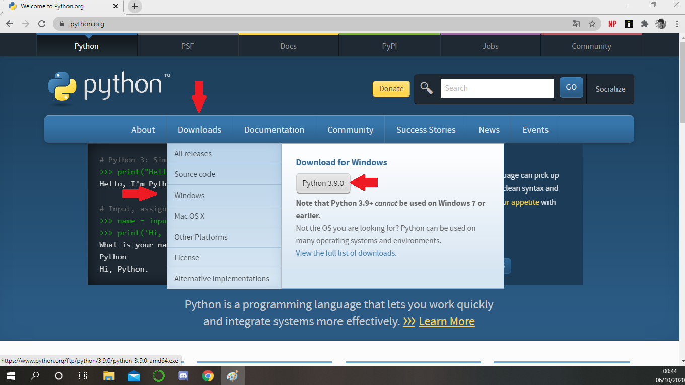
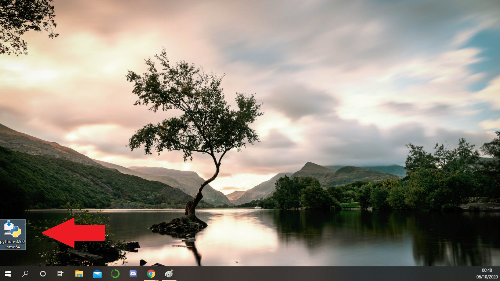
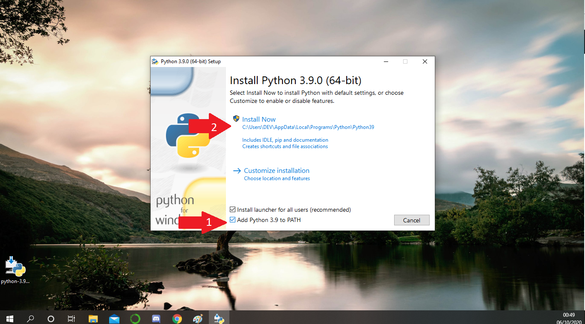
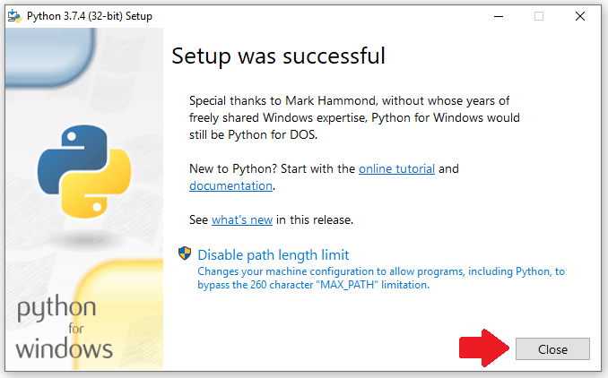
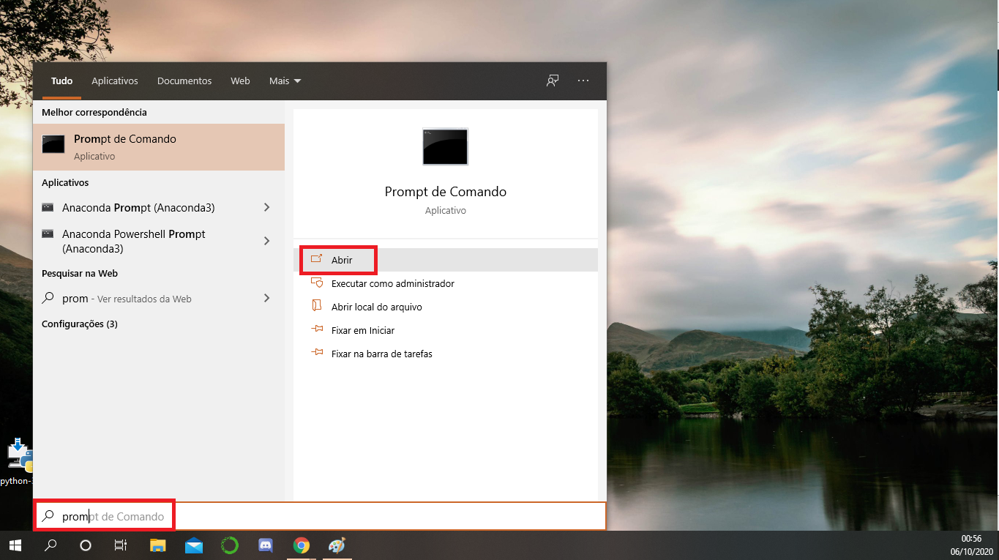
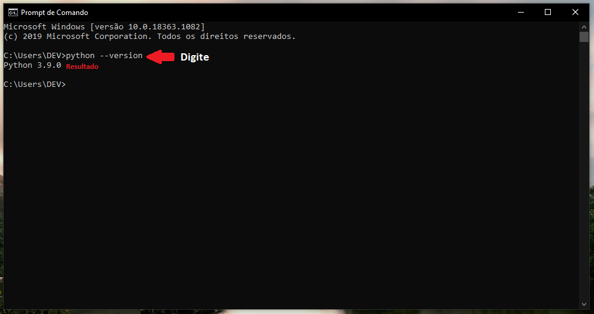
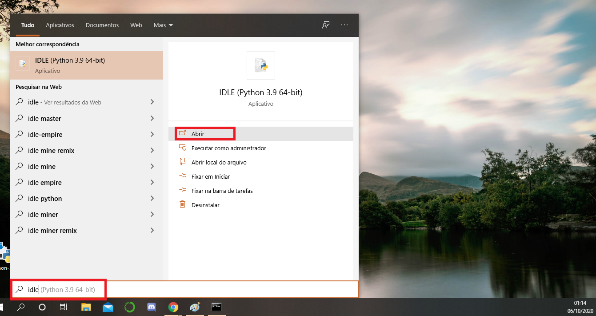

**TUTORIAL DE INSTALAÇÃO DO PYTHON**
=====================================

Não é comum que o python já venha instalado nas distribuições Windows. O passo a passo abaixo te conduzirá a instalar o python no seu computador!

1. Acesse o portal oficial do `python`_ .

.. image:: _static/install_py1.png

2. Faça o download do python para o **WINDOWS**.

3. Acesse o documento clicando nele.

4. Selecione as opções pertinentes.

5. Aguarde a Instalação.

.. image:: _static/install_py7.png

6. Após a mensagem de sucesso pressione ``close``

Verificando a versão instalada
-------------------------------

7. Vá no ``iniciar`` e digite:

.. code-tab::

   prompt de comando
   

8. Após clicar em ``abrir`` uma tela preta aparecerá. Digite:

.. code-tab::

   python --version  
   
Esta é a versão instalada no seu computador.

9. Teste a IDLE disponibilizada digitando ``idle`` no iniciar:

:ref: `INSTALAÇÃO DE PROGRAMAS RECOMENDADOS <windows_app>`
-----------------------------------------------------------

.. _python: https://www.python.org/
