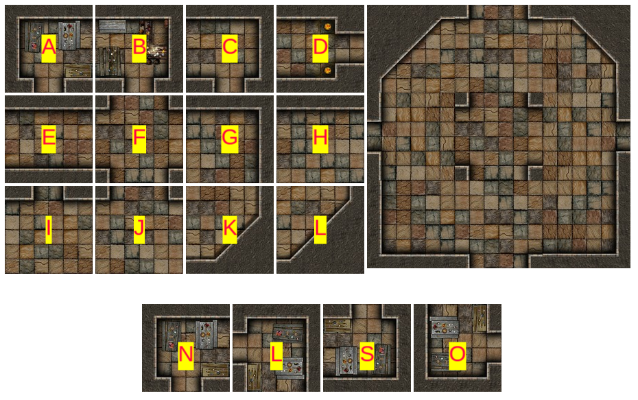

.. _desafio_a:

Criando uma Câmara com Constantes
=================================

Uma constante é um valor que não se modifica ao longo de um programa.
Em Python a constante é escrita com todas as letras maiúsculas como no nome TOPO_ESQUERDA abaixo.

Use os ladrilhos nomeados de A a L para montar a câmara mostrada à direita.

.. code-block:: python

    from _spy.circus.circus import circus

    TOPO_ESQUERDA = "AN"
    TOPO_DIREITA = "AN"
    TOPO_CENTRO = "AN"
    MEIO_ESQUERDA, CENTRO, MEIO_DIREITA = "AN", "AN", "AN"
    FUNDO_ESQUERDA, FUNDO_CENTRO, FUNDO_DIREITA =  "AN", "AN", "AN"

    # O comando abaixo voce vai entender no próximo desafio
    circus(1, [[TOPO_ESQUERDA, TOPO_CENTRO, TOPO_DIREITA], [MEIO_ESQUERDA, CENTRO,
            MEIO_DIREITA], [FUNDO_ESQUERDA, FUNDO_CENTRO, FUNDO_DIREITA]])

.. moduleauthor:: Carlo Oliveira <carlo@nce.ufrj.br>

.. note::

    No texto "AN" a primeira letra determina o ladriho e a segunda se está girada para Norte, Leste, Sul ou Oeste.
