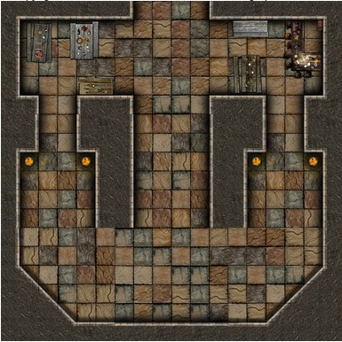

.. _desafio_j:

Uma Câmara Muito Instável
=========================

Esta câmara embaralha as posições e as direçoes se os ladrilhos não forem colocados corretamente.
Você terá que usar uma estratégia para montar os ladrilhos antes que eles embaralhem.

Use os ladrilhos nomeados de A a L para montar a câmara mostrada abaixo, consulte o exercício A.
Descubra quais posições os nomes misteriosos indicam.

.. code-block:: python

    from _spy.circus.circus import circus

    MASMORRA = {'Cahuitz': 'AN', 'Cauha': 'AN', 'Coycol': 'AN',
     'Huatlya': 'AN', 'Micpe': 'AN', 'Nenea': 'AN',
     'Pallotl': 'AN', 'Tetlah': 'AN', 'Zitllo': 'AN'}

    circus(5, MASMORRA)

.. moduleauthor:: Gabriel Bastos <gab-bass@poli.ufrj.br> / Philipe  < ? >

.. note::

    No texto "AN" a primeira letra determina o ladrilho e a segunda se está girada para Norte, Leste, Sul ou Oeste.
