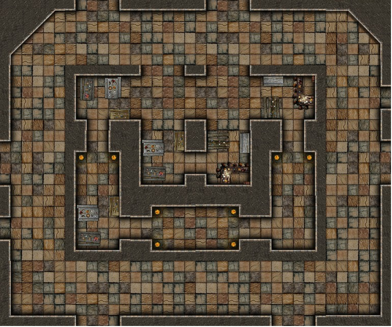

.. _jogo_a:

Primeiro Cenário do Jogo
========================

Vamos começar importando o módulo Circus para criar um jogo
baseado na biblioteca Phaser. Vamos criar uma organização em Python chamada *class*
que vai ter duas operações *preload* e *create*. O objetivo é mostrar a imagem abaixo:

.. code-block:: python

    from _spy.circus.game import Circus

    class Jogo(Circus):
        """Essa  é a classe Jogo que recebe os poderes da classe Circus de poder criar um jogo"""

        def preload(self):
            """Aqui no preload carregamos os recursos usados no jogo, neste caso a imagem masmorra"""
            self.image("fundo", "http://<descubra um jeito de achar a url que vai ser posta aqui>")

        def create(self):
            """Aqui colocamos a imagem masmorra na tela do jogo"""
            self.sprite("fundo")

    if __name__ == "__main__":
        Jogo()

.. moduleauthor:: Carlo Oliveira <carlo@nce.ufrj.br>

.. note::
   Ainda é um programa bem simples.
