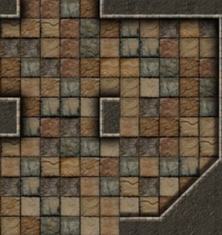

.. _jogo_b:

Montando a Cena com Ladrilhos
=============================

Na maior parte dos jogos o cenário tem que ser montado a partir de uma folha de ladrilhos.
As folhas de ladrilho são numeradas de 0 a n da esquerda para direita de cima para baixo.
Esta é a folha de ladrilhos:

.. image:: _static/DungeonWall.jpg

Procure reproduzir este labirinto:

.. code-block:: python

    from _spy.circus.game import Circus

    class Jogo(Circus):
        """Essa  é a classe Jogo que recebe os poderes da classe Circus de poder criar um jogo"""

        def preload(self):
            """Aqui no preload carregamos os recursos usados no jogo, neste caso a folha de ladrilhos"""
            self.spritesheet("ladrilho", "http://<advinha!>", 128, 128, 12)

        def create(self):
            """Aqui colocamos cada ladrilho indicando a posição na tela e depois selecionando o ladrilho"""
            um_ladrilho = self.sprite("ladrilho", 0, 0)
            um_ladrilho.frame = 5  # este número seleciona o ladrilho que vai ser colocado
            um_ladrilho = self.sprite("ladrilho", 0, 0)  # mude a posição do ladrilho
            um_ladrilho.frame = 5  # troque o ladrilho!
            # Coloque mais dois outros ladrilhos

    if __name__ == "__main__":
        Jogo()

.. moduleauthor:: Carlo Oliveira <carlo@nce.ufrj.br>

.. note::
   Ainda é um programa bem simples.
