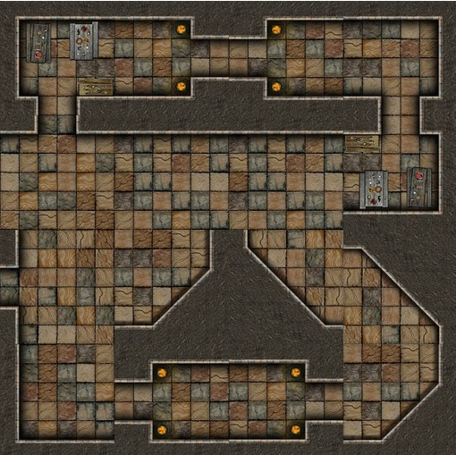

.. _jogo_d:

Cena com Mais Ladrilhos Girados
===============================

Vamos montar uma outra masmorrra, um pouco maior. Em vez de copiar várias vezes o código,
vamos usar uma *lista* de *tuplas* e o comando *for*
A folha de ladrilhos continua esta:

.. image:: _static/DungeonWall.jpg

Procure reproduzir este labirinto:

.. code-block:: python

    from _spy.circus.game import Circus

    class Jogo(Circus):
        """Essa  é a classe Jogo que recebe os poderes da classe Circus necessários para criar um jogo"""
        MOSAICO = [
        [(5, 90), (5, 90), (5, 90), (5, 90)],
        [(5, 90), (5, 90), (5, 90), (5, 90)],
        [(5, 90), (5, 90), (5, 90), (5, 90)],
        [(5, 90), (5, 90), (5, 90), (5, 90)]
        ]  # esta é uma lista de listas. Cada lista é uma linha e cada tupla dá o ladrilho (5) e o ângulo (90)

        def preload(self):
            """Aqui no preload carregamos os recursos usados no jogo, neste caso a folha de ladrilhos"""
            self.spritesheet("ladrilho", "http://<advinha!>", 128, 128, 12)

        def create(self):
            """Aqui colocamos um for que varre cada linha e cada coluna da matriz"""
            azulejo = self.MOSAICO
            for y in range(4):
               for x in range(4):
                  frame, angle = self.MOSAICO[y][x]  # este comando desmembra a tupla em duas variáveis, frame e angle
                  um_ladrilho = self.sprite("ladrilho", 64+x*128, 64+y*128)  # cria e muda a posição do ladrilho
                  um_ladrilho.frame = frame
                  um_ladrilho.anchor.setTo(0.5, 0.5)
                  um_ladrilho.angle = angle

    if __name__ == "__main__":
        Jogo()

.. moduleauthor:: Carlo Oliveira <carlo@nce.ufrj.br>

.. note::
   Observe que ao colocar a âncora no centro do ladrilho, este centro também servirá para posicionar o ladrilho.
   Ajuste as cordenadas para que tudo fique correto.
