.. Tutorial de Introdução à Computação documentation master file, created by
   sphinx-quickstart on Tue Feb 20 16:53:25 2018.
   You can adapt this file completely to your liking, but it should at least
   contain the root `toctree` directive.

**AÇÕES ENTRE PYCHARM E GITHUB**
================================

SINCRONIZANDO  GITHUB E PYCHARM
--------------------------------

Abra o IDE Pycharm e prima > Check out from Version Control <

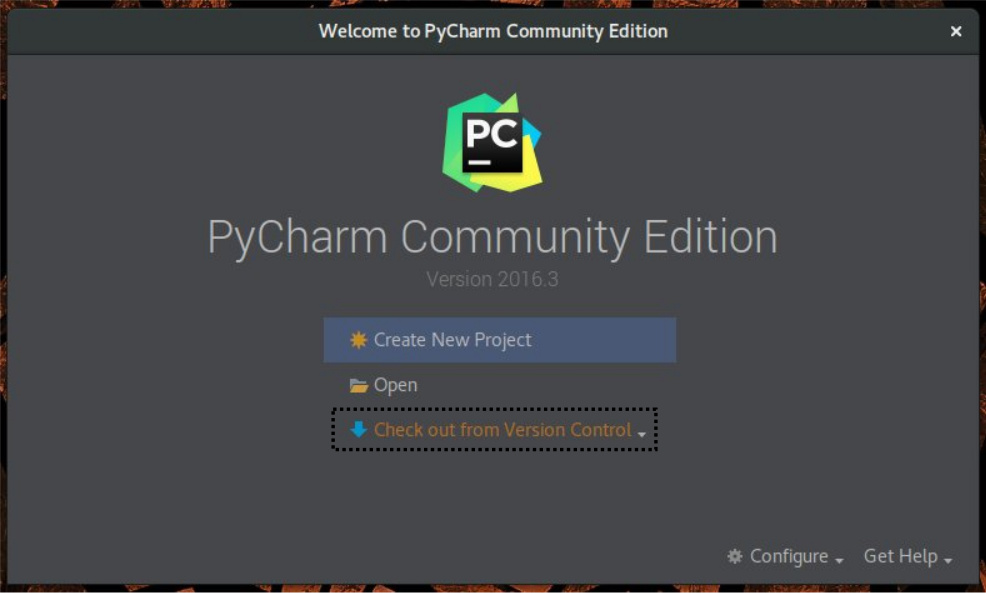

Ao abrir as opções, prima > GitHub < para resgatar e logar na plataforma.

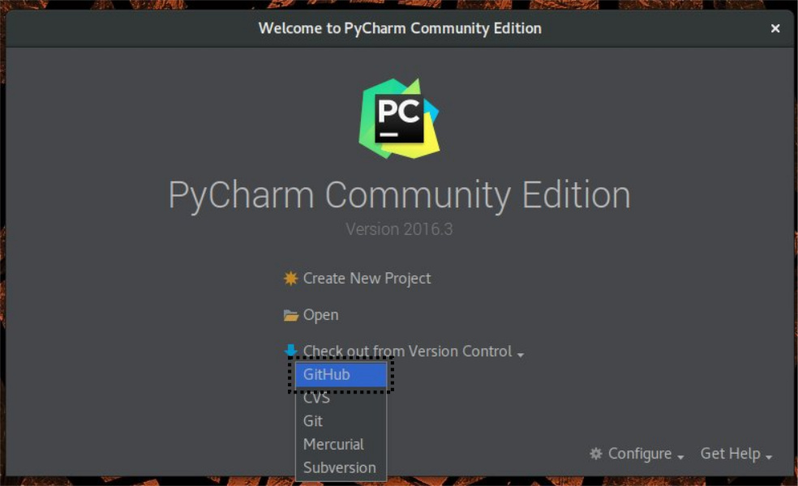

Insira suas informações de usuário e prima >Login<

      **Atenção:**

            Host: github.com

            Auth Type: Password

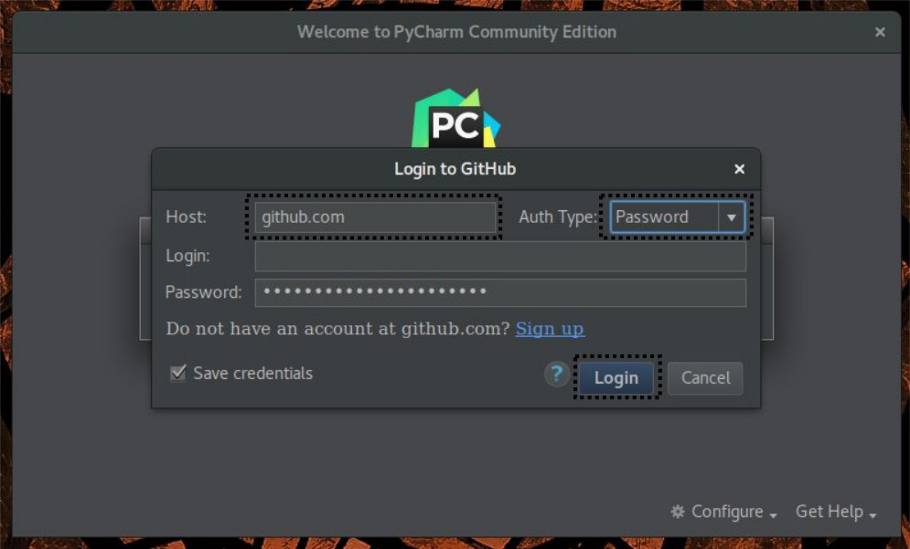

Na página seguinte, selecione o repositório do projeto >Git Repository URL<  e a “pasta pai” >Parent Directory<
-Veja Imagens- Feito isso, prima >Clone<

.. image:: _static/sincronizar4.jpg

Selecione o repositório a sua escolha

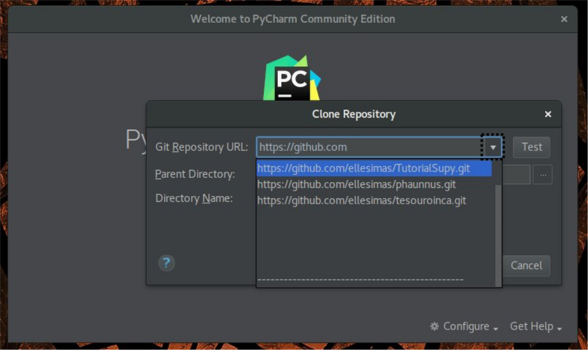

Selecione a pasta "pai" de seu interesse.

.. image:: _static/sincronizar6.jpg

Abrirá um pop-up perguntando se você gostaria de abrio o diretório. Clique no sim.

.. image:: _static/sincronizar7.jpg

COMO ABRIR O PROJETO NO PYCHARM
-------------------------------

Observe o lado esquerdo do seu cursor e clique na primeira pasta.

.. image:: _static/abrir1.jpg

Clique com o botão direito sobre o projeto > New > Directory> src

.. image:: _static/abrir2.jpg

Clique com o botão direito sobre src> New > Python File > “main”

.. image:: _static/abrir3.jpg

Vai aprir um pop-uppedindo para você confirmar o novo arquivo. Diga ok.

.. image:: _static/abrir4.jpg

Surge a aba do novo arquivo em Python. Porem ela vai esta na cor vermelha.

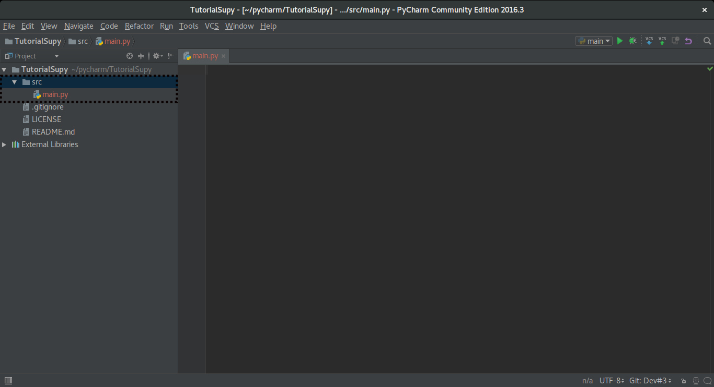

Para que seja realmente adicionado o arquivo, clique com o botão direito em src > git > +add

.. image:: _static/abrir6ok.jpg

Se o arquivo mudar de cor, ele está corretamente adicionado.

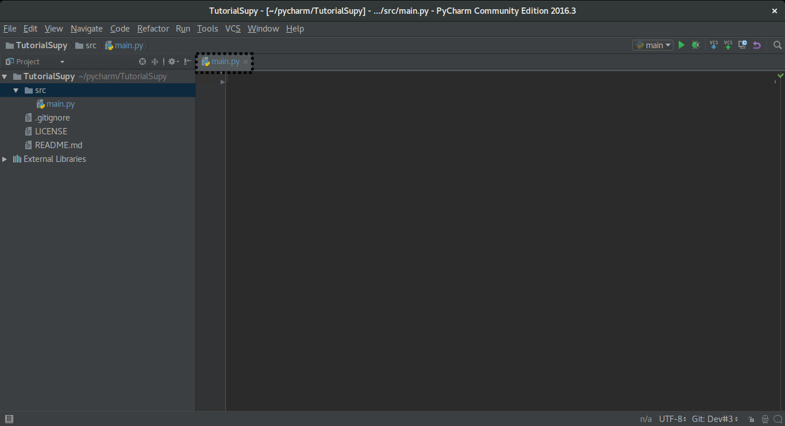

CRIAR UM <BRANCH>
-----------------

Localize o nome de seu issue.

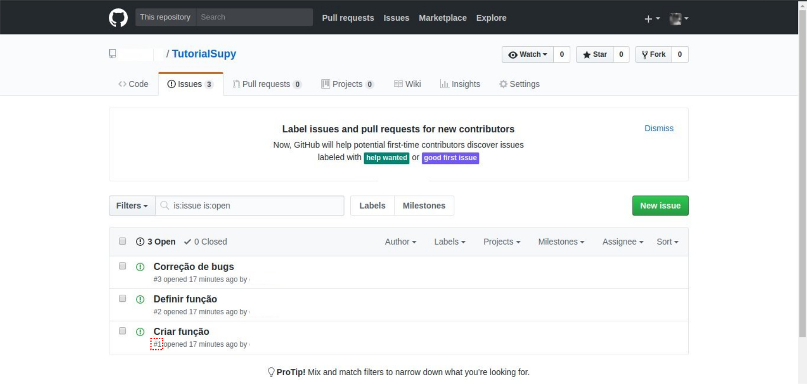

No pycharm, selecione o ícone setas > New Branch.

.. image:: _static/branch2.jpg

Nomeie seu Branch de forma a especificar o Issue que está trabalhando.

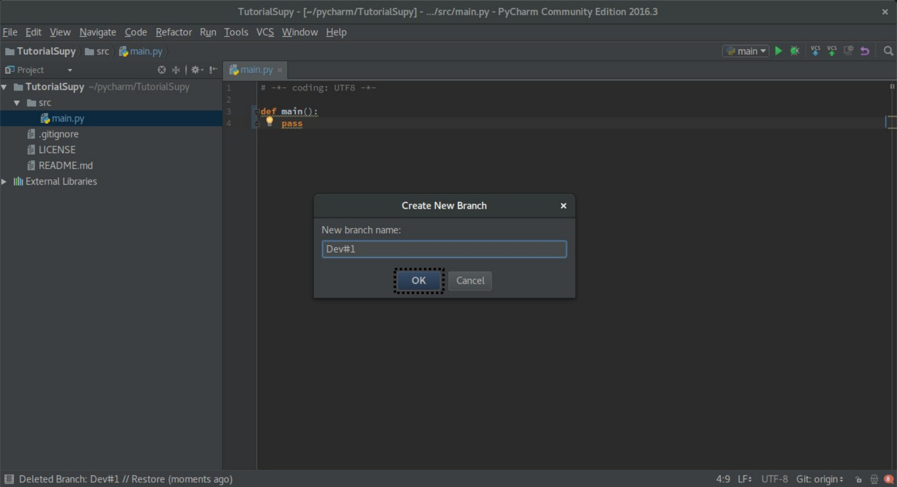

Na parte inferior da tela, aparecerá um balão dizendo que o branch foi criado.

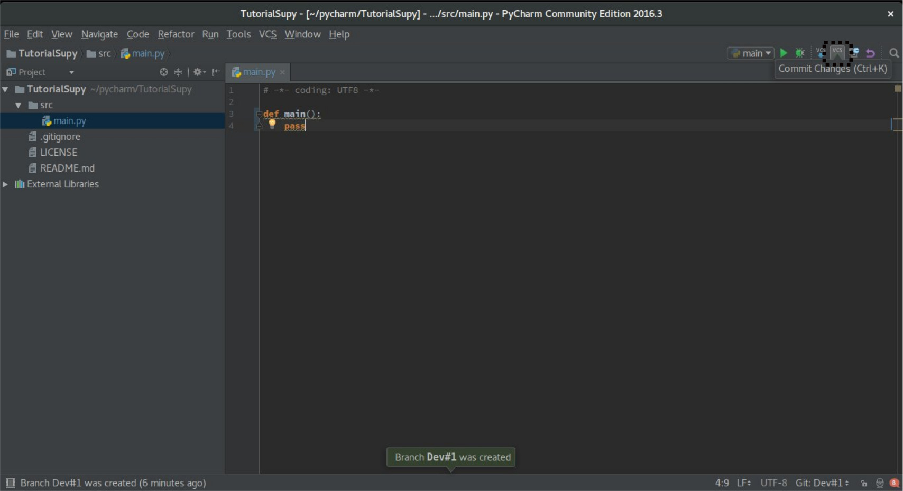

COMMIT
------

Como enviar mudanças.

Após programar algo que é novo, descreva o seu código > selecione ‘commit’ > prima commit and push.

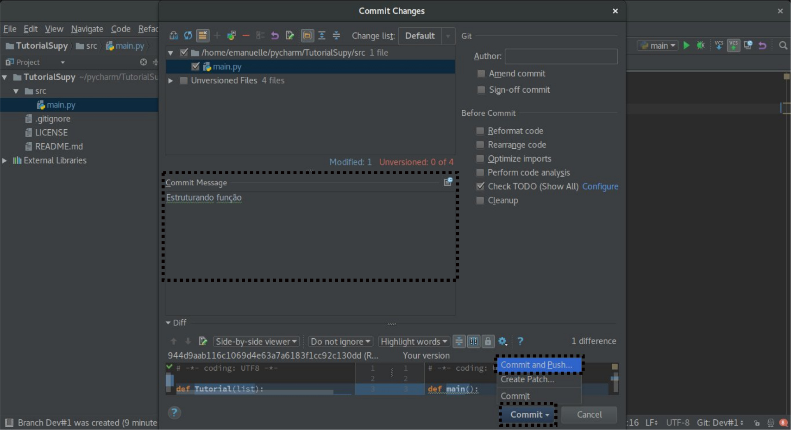

Aparecerá outra tela. Clique em push.

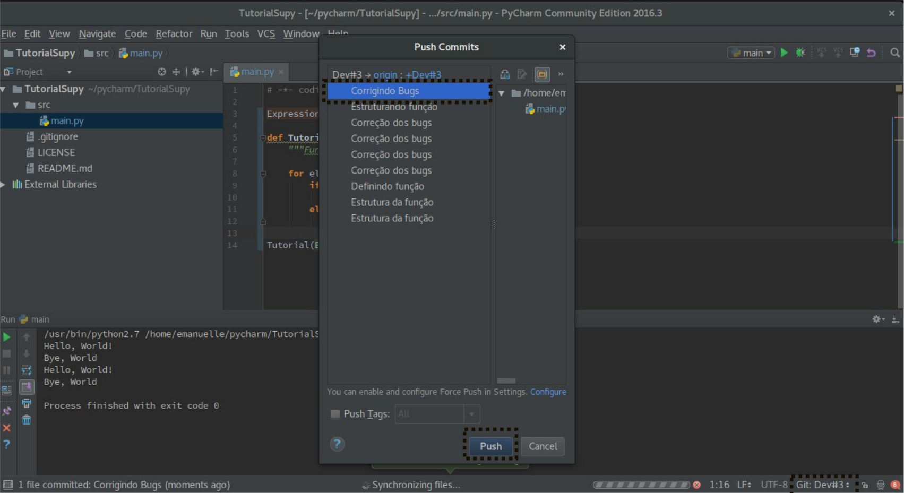

Pronto! Seu código foi enviado .

SALVAR MODIFICAÇÕES NA ORIGEM (MASTER)
--------------------------------------
Depois de enviar as últimas modificações. Abra o Github na aba code e dê um >Compare & Pull Request<

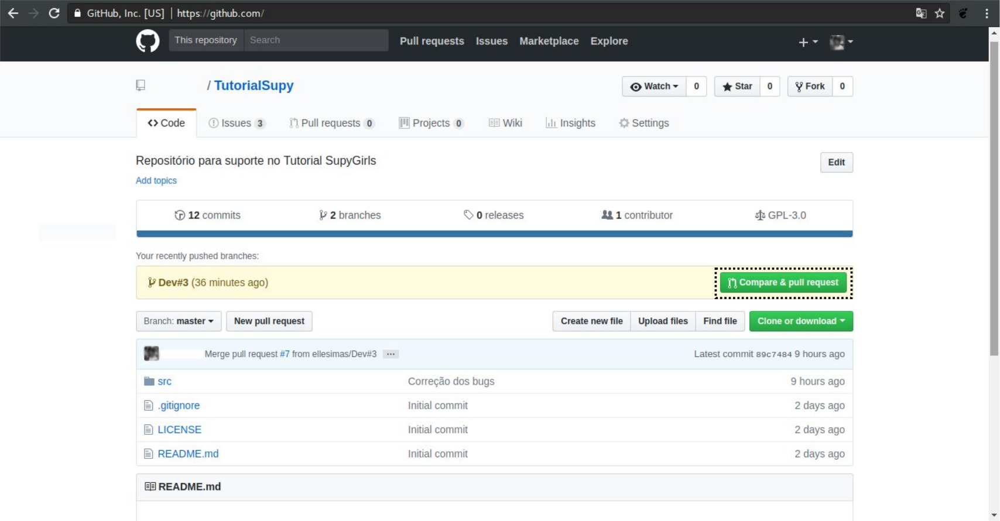

Clique em create and pull request.

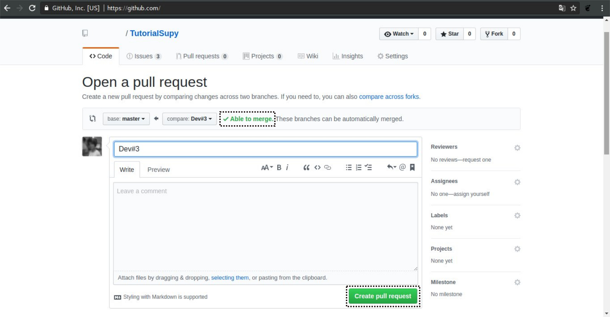

Aguarde o github acabar de checar

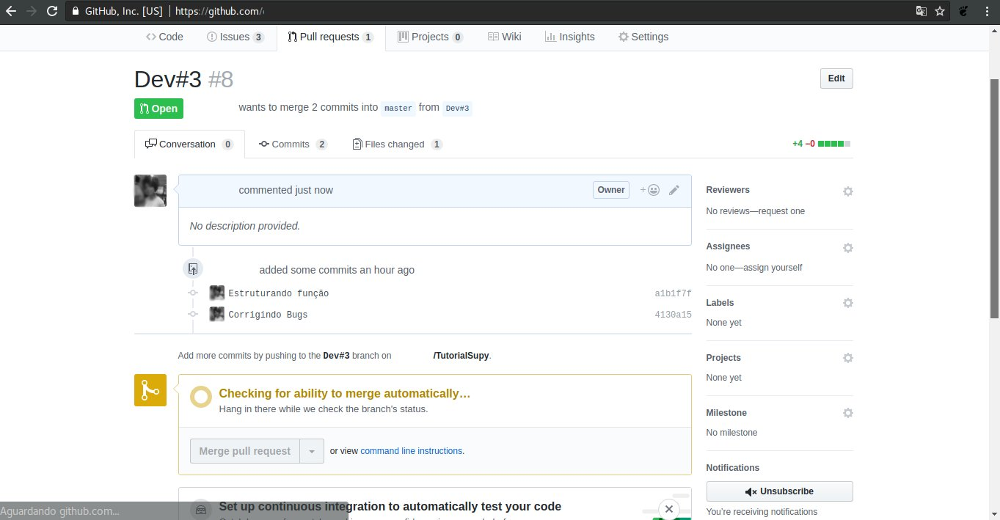

Clique em > Merge pull request<

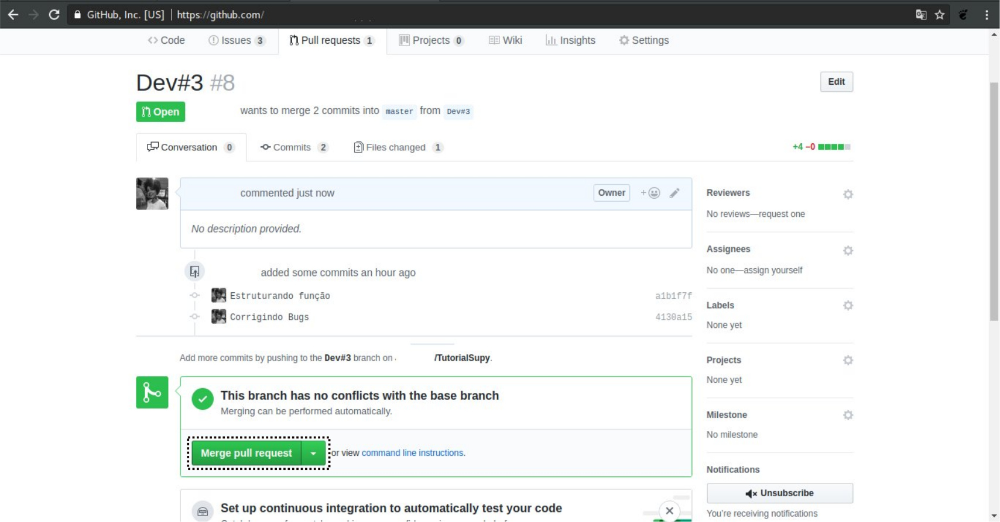

O seu pull request foi bem sucedido!

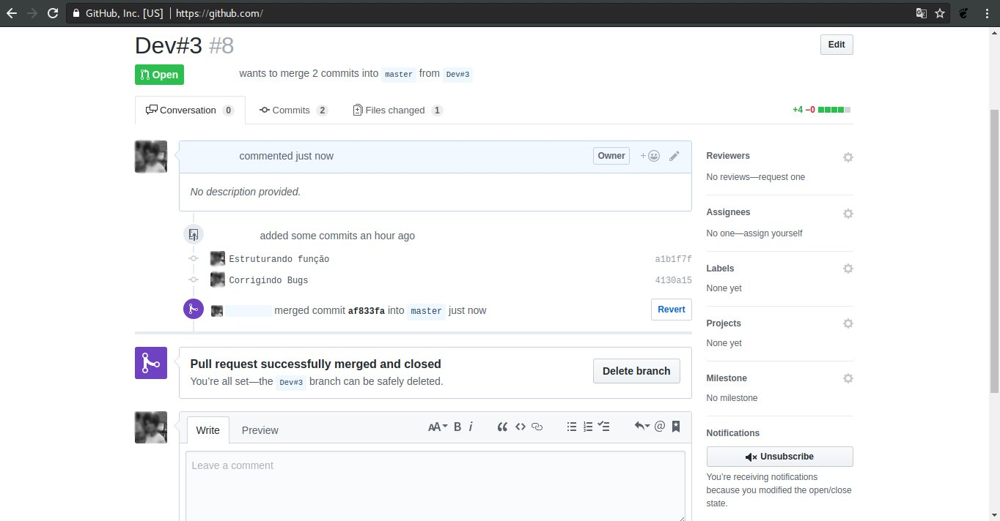

**DOCUMENTOS DE LEITURA**
=========================

SPHINX CHEATSHEET
-----------------

**MODELAGEM ÁGIL**
==================

USER STORIES
------------

CRC CARDS
---------

CHOOSE ISSUE
------------
Após a criação dos cards e seus issues, escolha o issue que ira trabalhar.

Vá para o Github, escolha o seu repositório e clique na aba issues.

Escolha um <issue> que deseja trabalhar e se inscreva nele.

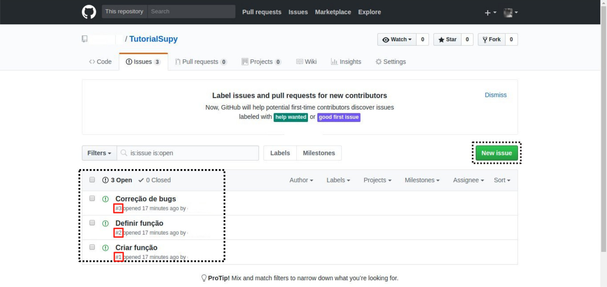

Clique em Assignees.

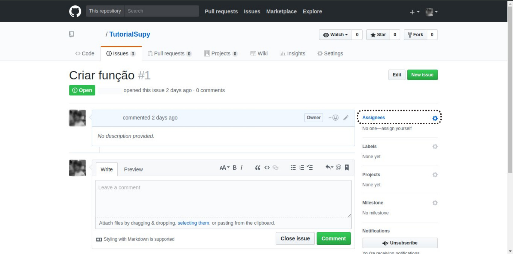

Escolha o seu perfil.

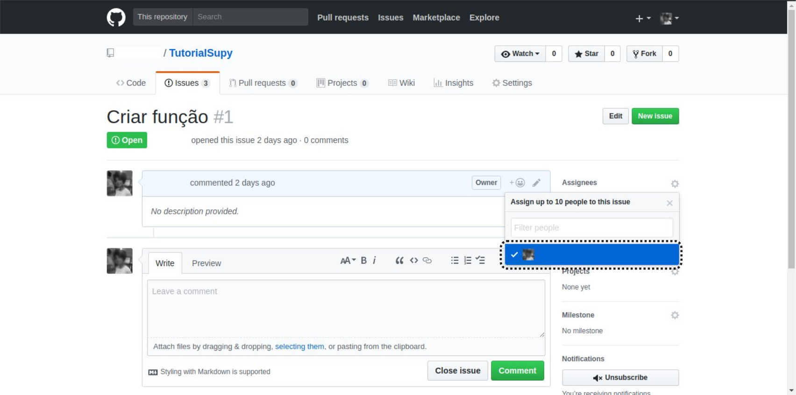

PRÉ-REQUISITOS PARA INTRODUÇÃO À COMPUTAÇÃO
===========================================

 * Abrir conta
      * Github
      * IDE Pycharm Version: 2017.3.3 ou superior
      * Slack
      * Waffle.io

