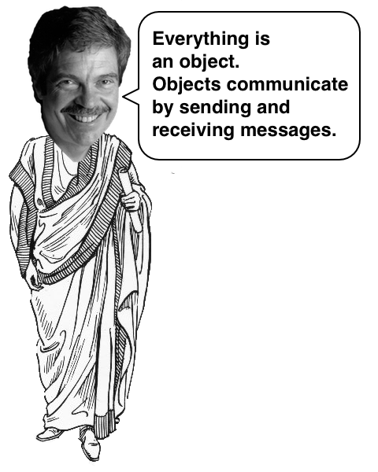
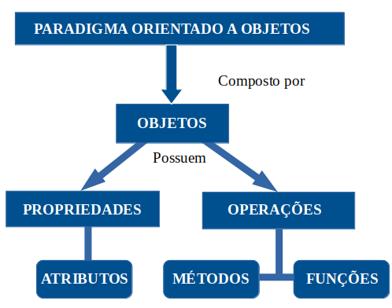
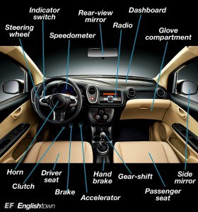
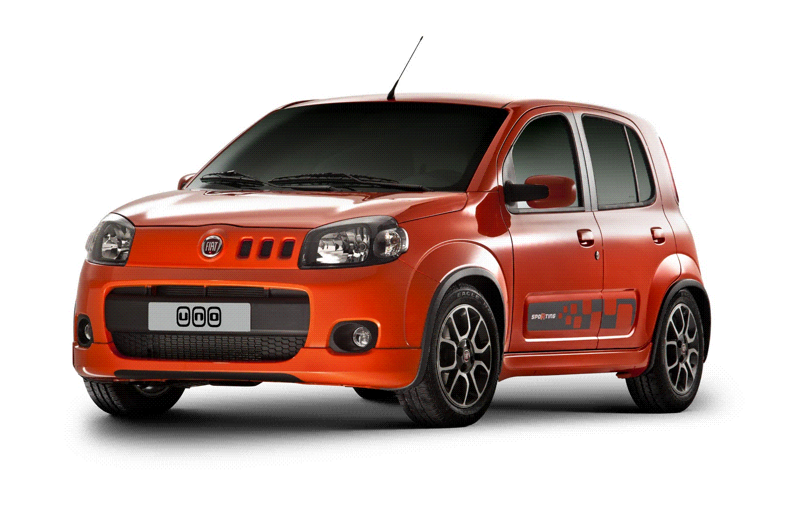
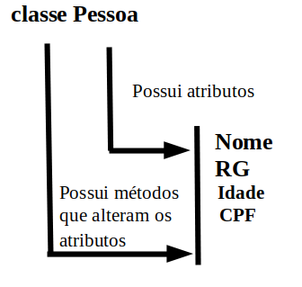
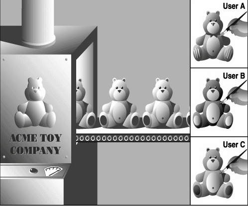

.. Understending  Python OO documentation master file, created by
   sphinx-quickstart on Mon May 14 11:27:45 2018.
   You can adapt this file completely to your liking, but it should at least
   contain the root `toctree` directive.

**Projetos com Python Orientado a objetos**
=====================================================

POR QUE PROGRAMAR COM PYTHON ORIENTADO A OBJETOS?

O objetivo do Python Orientado a Objetos é a aproximação do mundo real.

Tudo iniciou com Alan Kay que inventou a Linguagem de programação SmallTalk e e um dos pais do conceito de programação orientada a objetos.

Para a linguagem de programação SmallTalk tudo é objeto e não há tipos primitivos.

**O PARADIGMA**
=====================================================

Paradigma é a forma que vamos programar e executar o nosso software.

1 | Paradigma procedural: é baseado no conceito de chamados e procedimentos conhecidos como rotinas, funções, métodos.

2 | Paradigma OO: composto por objetos que possuem propriedades que são

Um exemplo para entender melhor:

Quero construir um carro com foco nas funcionalidades: frear, acelerar, mudar marcha, isso faz com que o Orientado a Objetos se aproxime do mundo real!

VANTAGENS OO:

1 | CONFIABILIDADE
    É o isolamento entre as partes isso quer dizer que quando alteramos uma parte a outra não necessariamente é afetada.

2 | OPORTUNO
    Os componentes do projeto podem ser desenvolvidos paralelamente.

3 | FACIL DE MANTER
    Permite uma maior facilidade para atualizar o software.

4 | EXTENSÍVEL
    Você pode ter um carro com 10 funcionalidades, mas depois de um tempo criar uma nova versão com 50 funcionalidades, você não precisa recriar o objeto, você já tem várias partes prontas é só aproveitar!

5 | REUTILIZAVEL
    Criamos uma classe Carro para representar o carro.
    Podemos utilizar essa classe para um sistema de uma loja de carros.
    Podemos utilizar novamente para um sistema de oficinas de carros
    Aproveitamos essa classe para um ainfinidade de outros projetos.

6 | NATURAL
    Se aproxima do mundo real.
    Está focado mais nas funcionalidades do quenos detalhes da implementação.
    É mais fácil de compreender!

**Classe e Objeto - Isso você tem que entender!!!**
=====================================================

O que é um objeto?
É algo material ou abstrato que pode ser percebido pelos sentidos e descrito por meio das suas caracteristicas, comportamentos e estado atual (status)
Por exemplo "o carro":

Como podemos descrever esse carro?
Características: cor, marca, fabricante e outros
As características do carro são os seus atributos(campos)!
cor = preto, verde, azul, amarelo

Comportamentos: Acelerar, frear, ligar o som entre outros

Estado atual: É representado pelos valores dos atributos naquele momento que é analisado.

Importante:
Podemos ter vários tipos de carros
Ao criar um carro teremos um modelo, um molde, um formato.

Agora temos o carro e o molde para fazer o carro!

CARRO = OBJETO
MOLDE = CLASSE

O que faz esse carro são os métodos
Os métodos pertencem a uma classe
métodos = acelerar, passar a marcha, diminuir a velocidade etc
Através dos métodos conseguimos mexer com os atributos do objeto.

Todo objeto vem a partir de uma classe, a partir de um molde/modelo

A classe define quem são os atributos e métodos comuns que serão compartilhados por um objeto.

**Instanciar o que é isso?**
=====================================================

Quando temos uma classe e queremos gerar um objeto a partir dela então você faz o instanciamento.

Instanciar é gerar um objeto a partir de uma classe!

c =  Carro()   --> c é instancia da classe Carro

**O que é uma classe?**
=====================================================

Classe é um termo usado para um tipo de objeto
As classes descrevem os objetos
A classe serve como modelo, como molde para armazenar informações e realizar tarefas.

Uma classe pode conter vários elementos

Podemos ter várias classes, os objetos dessas classes são instanciados de forma que a execução do programa é vista como um conjunto de objetos relacionados que se comunicam envianod mensagens uns para outros.

