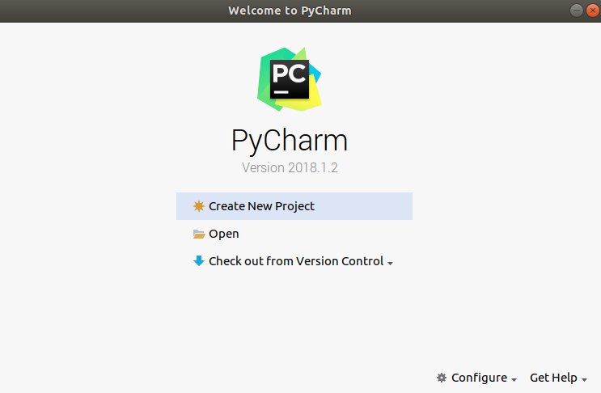
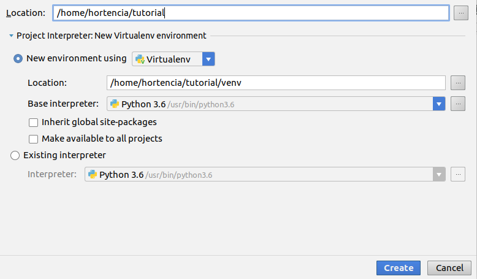
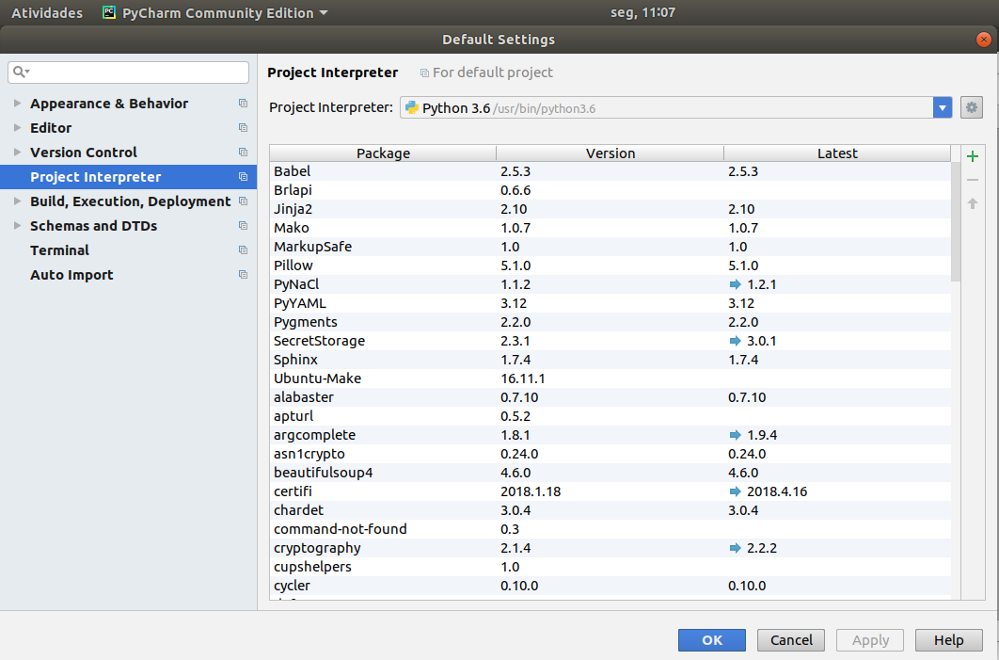
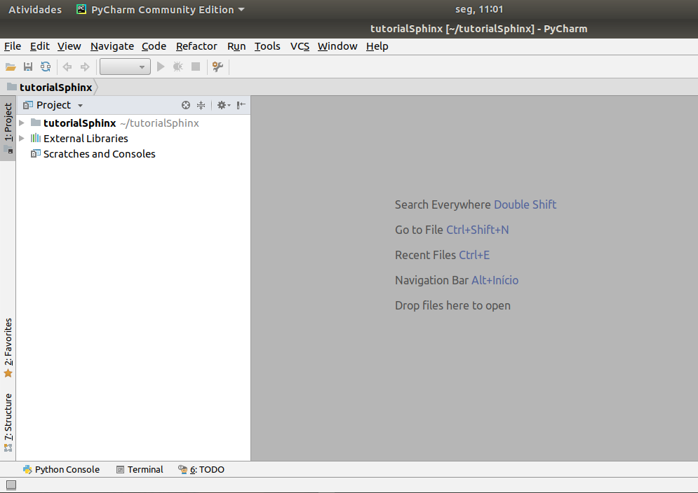
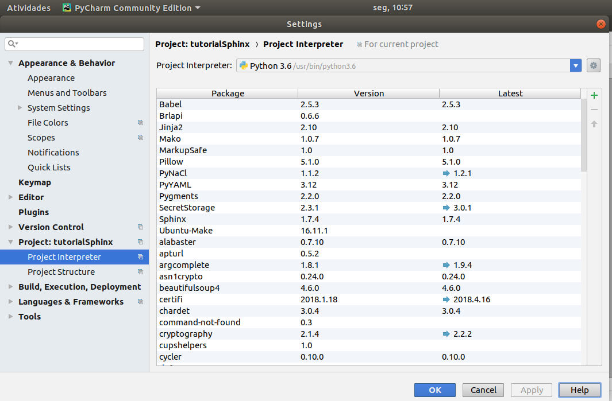
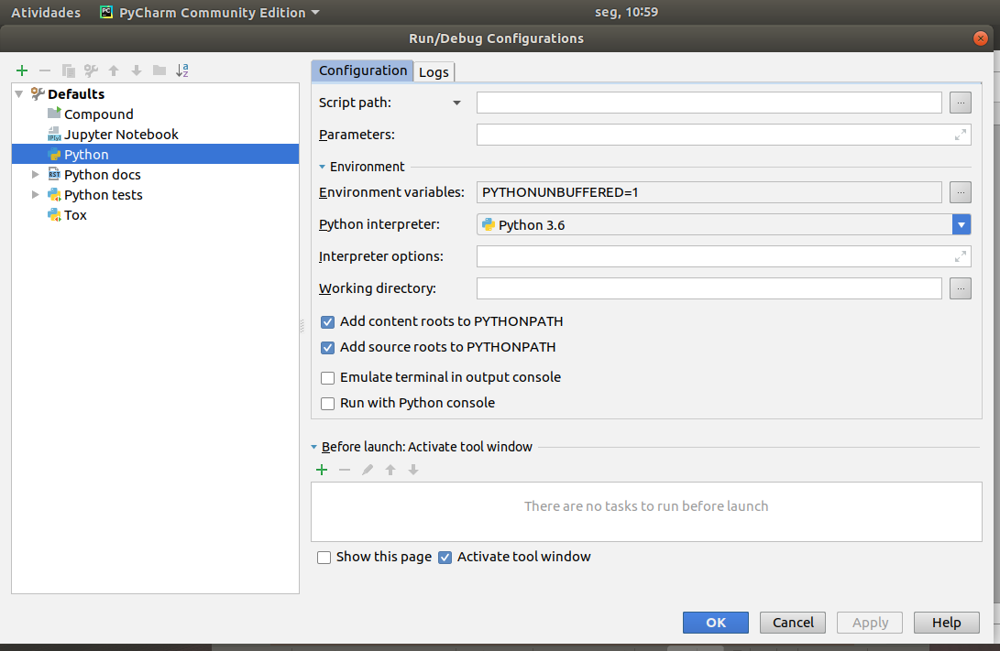
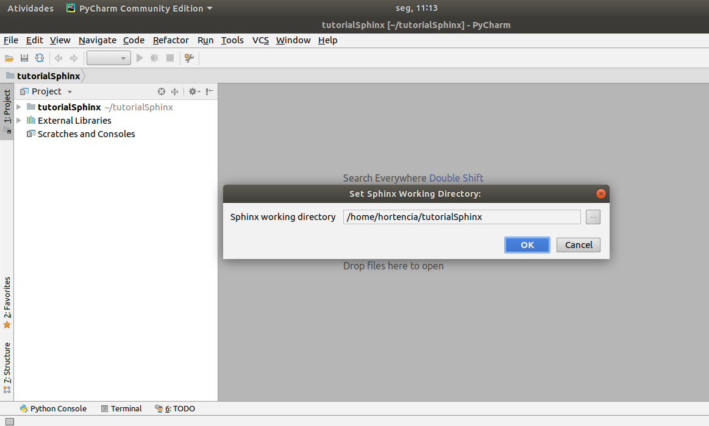
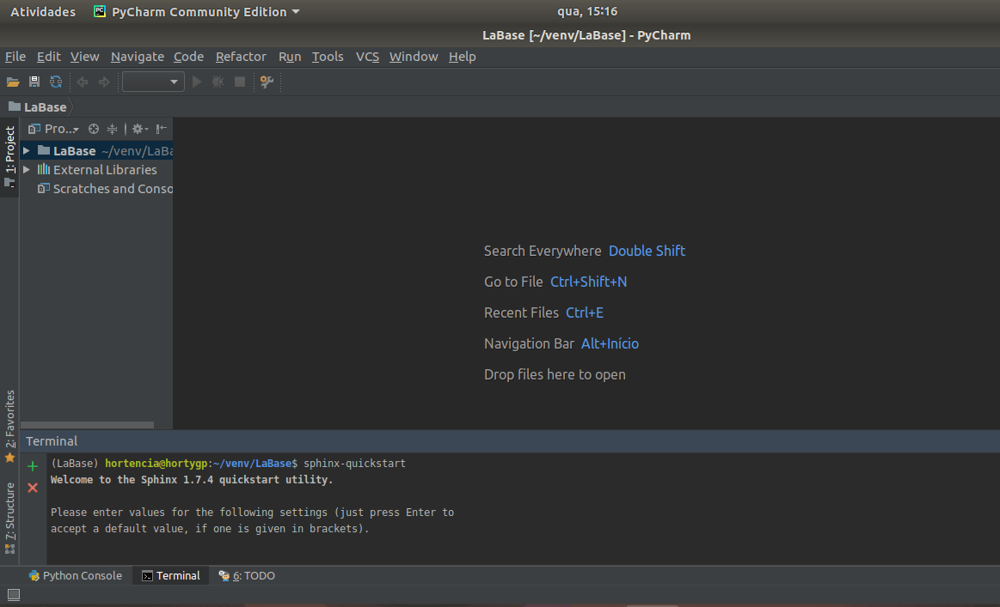
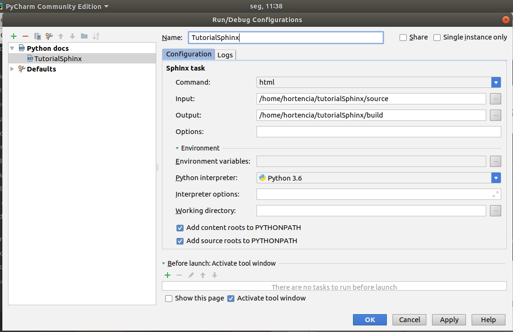
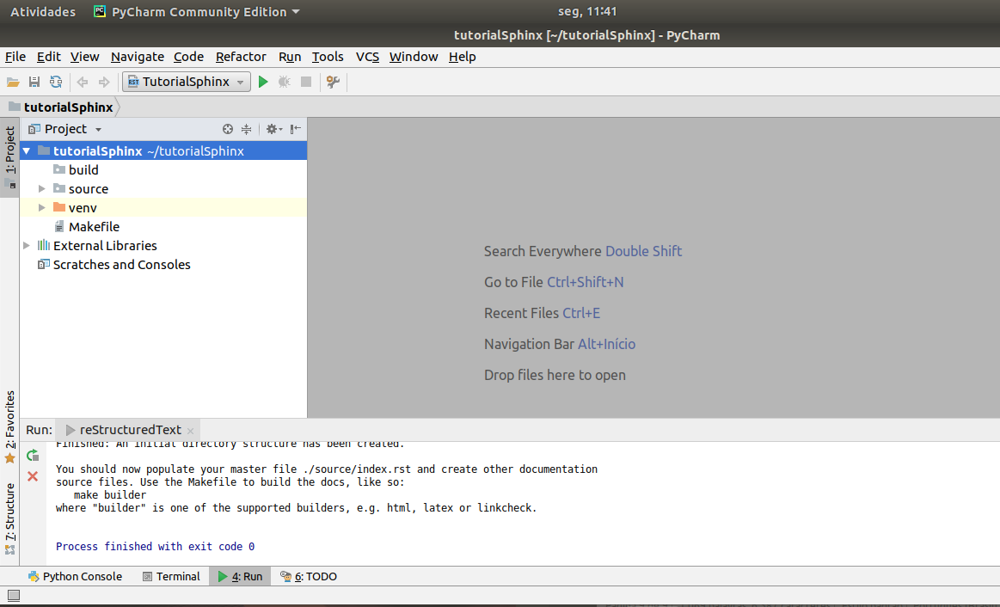

.. TutorialSphinx documentation master file, created by
   sphinx-quickstart on Mon May 14 11:27:45 2018.
   You can adapt this file completely to your liking, but it should at least
   contain the root `toctree` directive.

**Bem Vindos ao Tutorial de documentação Sphinx!**
==================================================

COMO CRIAR UM PROJETO PARA GERAR UMA PAGINA WEB UTILIZANDO O SPHINX

O Sphinx é uma ferramenta que gera documentação simples mas  sofisticada, gera de maneira facil arquivos em diversos formatos.
Requisitos:

Python precisa estar instalado em sua máquina. Verifique a versão no seu terminal:

1 | $python --version

2 | $sudo apt install python3-pip

Java: veja se seu PC tem o java instalados.

1 | $java –version

2 | $sudo apt-get install default-jre

3 | $sudo apt-get install default-jdk

Pycharm também precisa estar instalado, no meu computador eu tenho a versão PyCharm Community Edition. Vamos utilizar o snap para instalar.
No terminal:

1 |  $sudo apt-get install snapd snapd-xdg-open

2 |  $sudo snap install pycharm-community --classic

Agora só falta instalar o Sphinx!!!
1 |  $sudo pip3 install sphinx

CRIANDO UM NOVO PROJETO NO SPHINX
Abra a IDE PyCharm → Create New Project

Localização e nome do projeto → “dar o nome” → ir em create

É importante que todas as ferramentas abaixo estejam visíveis. Para isso vá no menu view e marque:

    Tool bar
    Tool buttons
    Status Bar
    Navigation Bar

Verifique se o interpretador python 3.6 está instalado

file → default settings – Project Interpreter – verifique se o Python instalado, se não clique na seta e adicione. Depois vá em apply e Ok

Verifique se o interpretador python 3.6 está instalado como interpretador no Sphinx Clique na chave de boca que aparece no menu

Project tutorialSphinx → Project Interpreter – verifique se o Python instalado, se não clique na seta e adicione. Depois vá em apply e Ok

Verifique se o sue interpretador Python está rodando normalmente no Pycharm
Run → edit configuration → default

Agora está faltando a ultima verificação!!!!
Temos que ver se o Sphinx está aparecendo no menu:
Vá no menu Tools e veriifque se o sphinx QuickStar está sendo usado → clica nele → vai aparecer a tela abaixo e clica ok

Ops!!!! ele não apareceu…. Se o Sphinx Quickstart não estiver lá no menu: vá no Terminal e digite sphinx-quickstart

Agora aparecem algumas perguntas para você trabalho, se quiser faça uma pesquisa sobre essas perguntas em http://docs.readthedocs.io/en/latest/getting_started.html e se informe.

PERGUNTAS E RESPOSTAS:

/usr/bin/sphinx-quickstart

Welcome to the Sphinx 1.7.4 quickstart utility.

Please enter values for the following settings (just press Enter to accept a default value, if one is given in brackets).

Selected root path: .

    You have two options for placing the build directory for Sphinx output. Either, you use a directory "_build" within the root path, or you separate "source" and "build" directories within the root path.
    Separate source and build directories (y/n) [n]: y

    Inside the root directory, two more directories will be created; "_templates" for custom HTML templates and "_static" for custom stylesheets and other static files. You can enter another prefix (such as ".") to replace the underscore.

    Name prefix for templates and static dir [_]: Enter

    The project name will occur in several places in the built documentation.

    Project name: TutorialSphinx

    Author name(s): Hortencia

    Sphinx has the notion of a "version" and a "release" for the software. Each version can have multiple releases. For example, for Python the version is something like 2.5 or 3.0, while the release is something like 2.5.1 or 3.0a1. If you don't need this dual structure, just set both to the same value.

    Project version []: 1.0

    Project release [1.0]: 1.0

    If the documents are to be written in a language other than English, you can select a language here by its language code. Sphinx will then translate text that it generates into that language.
    For a list of supported codes, see http://sphinx-doc.org/config.html#confval-language

    Project language [en]: pt-br

    The file name suffix for source files. Commonly, this is either ".txt" or ".rst". Only files with this suffix are considered documents.

    Source file suffix [.rst]: Enter

    One document is special in that it is considered the top node of the "contents tree", that is, it is the root of the hierarchical structure of the documents. Normally, this is "index", but if your "index" document is a custom template, you can also set this to another filename.

    Name of your master document (without suffix) [index]: Enter

    Sphinx can also add configuration for epub output: Do you want to use the epub builder (y/n) [n]: n

    Indicate which of the following Sphinx extensions should be enabled:

    autodoc: automatically insert docstrings from modules (y/n) [n]: y

    doctest: automatically test code snippets in doctest blocks (y/n) [n]: n

    intersphinx: link between Sphinx documentation of different projects (y/n) [n]: n

    todo: write "todo" entries that can be shown or hidden on build (y/n) [n]: n

    coverage: checks for documentation coverage (y/n) [n]: n

    imgmath: include math, rendered as PNG or SVG images (y/n) [n]: n

    mathjax: include math, rendered in the browser by MathJax (y/n) [n]: n

    ifconfig: conditional inclusion of content based on config values (y/n) [n]: n

    viewcode: include links to the source code of documented Python objects (y/n) [n]: y

    githubpages: create .nojekyll file to publish the document on GitHub pages (y/n) [n]: y

    A Makefile and a Windows command file can be generated for you so that you only have to run e.g. `make html' instead of invoking sphinx-build directly.

    Create Makefile? (y/n) [y]: y

    Create Windows command file? (y/n) [y]: n

Creating file ./source/conf.py.

Creating file ./source/index.rst.

Creating file ./Makefile.

Finished: An initial directory structure has been created.

You should now populate your master file ./source/index.rst and create other documentation source files. Use the Makefile to build the docs, like so:
make builder

where "builder" is one of the supported builders, e.g. html, latex or linkcheck.

Process finished with exit code 0

Depois de responder as perguntas acima você deve criar um python docs em edit configurations
Run → edit configuration → ir no sinal de adição

python docs
sphinx task
Importante!!!! Não pode esquecer de colocar o Nome
input : source
output: build
Apply → ok

No menu --> Edit Configuration vai aparecer o nome que você deu para teu sphinx clicar em play a seta verde

No canto direito os navegadores instalados (google, firefox e opera) aparecem para rodar na web